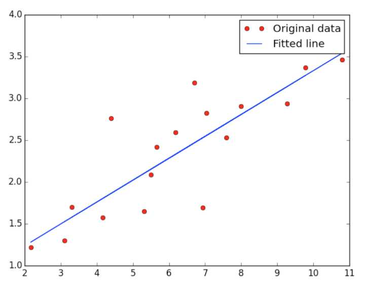

# TensorFlow入门
## Hello World
``` python
import tensorflow as tf
hello = tf.constant('Hello, TensorFlow!')
sess = tf.Session()
print sess.run(hello)
```
首先，通过**tf.constant**创建一个常量，然后启动Tensorflow的Session，调用sess的run方法来启动整个graph。

接下来我们做下简单的数学的方法：

``` python
import tensorflow as tf
a = tf.constant(2)
b = tf.constant(3)
with tf.Session() as sess:
    print "a=2, b=3"
    print "Addition with constants: %i" % sess.run(a+b)
    print "Multiplication with constants: %i" % sess.run(a*b)
# output
a=2, b=3
Addition with constants: 5
Multiplication with constants: 6
```

接下来用tensorflow的placeholder来定义变量做类似计算：

``` python
import tensorflow as tf
a = tf.placeholder(tf.int16)
b = tf.placeholder(tf.int16)
add = tf.add(a, b)
mul = tf.mul(a, b)
with tf.Session() as sess:
    # Run every operation with variable input
    print "Addition with variables: %i" % sess.run(add, feed_dict={a: 2, b: 3})
    print "Multiplication with variables: %i" % sess.run(mul, feed_dict={a: 2, b: 3})
# output:
Addition with variables: 5
Multiplication with variables: 6
matrix1 = tf.constant([[3., 3.]])
matrix2 = tf.constant([[2.],[2.]])
product=tf.matmul(matrix1,matrix2)
with tf.Session() as sess:
    result = sess.run(product)
    print result
    #result:
    12
```

## 线性回归

``` python
import tensorflow as tf
import numpy
import matplotlib.pyplot as plt
rng = numpy.random

# Parameters
learning_rate = 0.01
training_epochs = 2000
display_step = 50

# Training Data
train_X = numpy.asarray([3.3,4.4,5.5,6.71,6.93,4.168,9.779,6.182,7.59,2.167,7.042,10.791,5.313,7.997,5.654,9.27,3.1])
train_Y = numpy.asarray([1.7,2.76,2.09,3.19,1.694,1.573,3.366,2.596,2.53,1.221,2.827,3.465,1.65,2.904,2.42,2.94,1.3])
n_samples = train_X.shape[0]

# tf Graph Input
X = tf.placeholder("float")
Y = tf.placeholder("float")

# Create Model

# Set model weights
W = tf.Variable(rng.randn(), name="weight")
b = tf.Variable(rng.randn(), name="bias")

# Construct a linear model
activation = tf.add(tf.mul(X, W), b)

# Minimize the squared errors
cost = tf.reduce_sum(tf.pow(activation-Y, 2))/(2*n_samples) #L2 loss
optimizer = tf.train.GradientDescentOptimizer(learning_rate).minimize(cost) #Gradient descent

# Initializing the variables
init = tf.initialize_all_variables()

# Launch the graph
with tf.Session() as sess:
    sess.run(init)

    # Fit all training data
    for epoch in range(training_epochs):
        for (x, y) in zip(train_X, train_Y):
            sess.run(optimizer, feed_dict={X: x, Y: y})

        #Display logs per epoch step
        if epoch % display_step == 0:
            print "Epoch:", '%04d' % (epoch+1), "cost=", \
                "{:.9f}".format(sess.run(cost, feed_dict={X: train_X, Y:train_Y})), \
                "W=", sess.run(W), "b=", sess.run(b)

    print "Optimization Finished!"
    print "cost=", sess.run(cost, feed_dict={X: train_X, Y: train_Y}), \
          "W=", sess.run(W), "b=", sess.run(b)

    #Graphic display
    plt.plot(train_X, train_Y, 'ro', label='Original data')
    plt.plot(train_X, sess.run(W) * train_X + sess.run(b), label='Fitted line')
    plt.legend()
    plt.show()
```



## 逻辑回归

``` python
import tensorflow as tf
# Import MINST data
from tensorflow.examples.tutorials.mnist import input_data
mnist = input_data.read_data_sets("/tmp/data/", one_hot=True)

# Parameters
learning_rate = 0.01
training_epochs = 25
batch_size = 100
display_step = 1

# tf Graph Input
x = tf.placeholder(tf.float32, [None, 784]) # mnist data image of shape 28*28=784
y = tf.placeholder(tf.float32, [None, 10]) # 0-9 digits recognition => 10 classes

# Set model weights
W = tf.Variable(tf.zeros([784, 10]))
b = tf.Variable(tf.zeros([10]))

# Construct model
pred = tf.nn.softmax(tf.matmul(x, W) + b) # Softmax

# Minimize error using cross entropy
cost = tf.reduce_mean(-tf.reduce_sum(y*tf.log(pred), reduction_indices=1))
# Gradient Descent
optimizer = tf.train.GradientDescentOptimizer(learning_rate).minimize(cost)

# Initializing the variables
init = tf.initialize_all_variables()

# Launch the graph
with tf.Session() as sess:
    sess.run(init)

    # Training cycle
    for epoch in range(training_epochs):
        avg_cost = 0.
        total_batch = int(mnist.train.num_examples/batch_size)
        # Loop over all batches
        for i in range(total_batch):
            batch_xs, batch_ys = mnist.train.next_batch(batch_size)
            # Run optimization op (backprop) and cost op (to get loss value)
            _, c = sess.run([optimizer, cost], feed_dict={x: batch_xs,
                                                          y: batch_ys})
            # Compute average loss
            avg_cost += c / total_batch
        # Display logs per epoch step
        if (epoch+1) % display_step == 0:
            print "Epoch:", '%04d' % (epoch+1), "cost=", "{:.9f}".format(avg_cost)

    print "Optimization Finished!"

    # Test model
    correct_prediction = tf.equal(tf.argmax(pred, 1), tf.argmax(y, 1))
    # Calculate accuracy
    accuracy = tf.reduce_mean(tf.cast(correct_prediction, tf.float32))
    print "Accuracy:", accuracy.eval({x: mnist.test.images, y: mnist.test.labels})

    # result :
    Epoch: 0001 cost= 29.860467369
    Epoch: 0002 cost= 22.001451784
    Epoch: 0003 cost= 21.019925554
    Epoch: 0004 cost= 20.561320320
    Epoch: 0005 cost= 20.109135756
    Epoch: 0006 cost= 19.927862290
    Epoch: 0007 cost= 19.548687116
    Epoch: 0008 cost= 19.429119071
    Epoch: 0009 cost= 19.397068211
    Epoch: 0010 cost= 19.180813479
    Epoch: 0011 cost= 19.026808132
    Epoch: 0012 cost= 19.057875510
    Epoch: 0013 cost= 19.009575057
    Epoch: 0014 cost= 18.873240641
    Epoch: 0015 cost= 18.718575359
    Epoch: 0016 cost= 18.718761925
    Epoch: 0017 cost= 18.673640560
    Epoch: 0018 cost= 18.562128253
    Epoch: 0019 cost= 18.458205289
    Epoch: 0020 cost= 18.538211225
    Epoch: 0021 cost= 18.443384213
    Epoch: 0022 cost= 18.428727668
    Epoch: 0023 cost= 18.304270616
    Epoch: 0024 cost= 18.323529782
    Epoch: 0025 cost= 18.247192113
    Optimization Finished!
    (10000, 784)
    Accuracy 0.9206
```

这里逻辑回归，model是一个softmax函数用来做多元分类，大概意思是选择10当中最后预测概率最高作为最终的分类。
