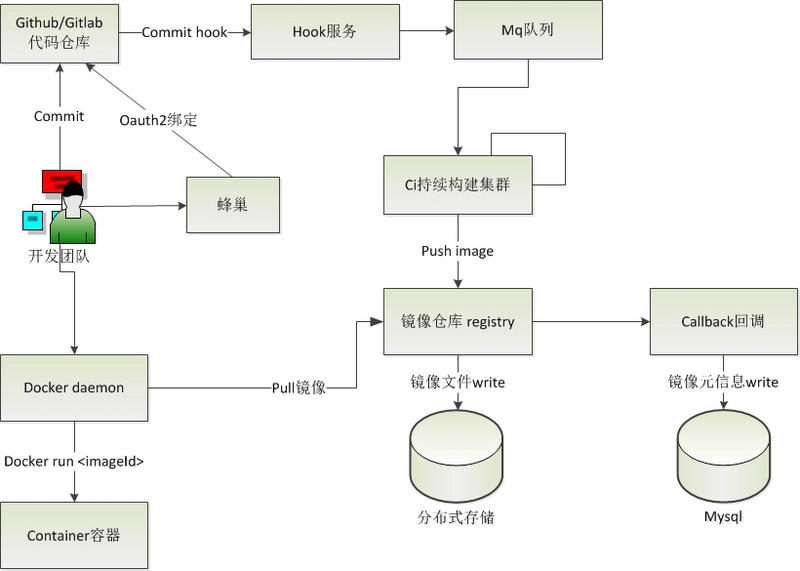

# 基于Docker的持续构建实现
**持续集成**是一种软件开发实践。在一个团队中开发人员经常会对他们的工作进行集成，这个频率通常为每人每天至少集成一次，这也就意味着一个团队每天可能会面临着多次集成。

在进行集成时，团队成员会通过自动化地构建，包括编译、发布、自动化测试来验证。在这个过程中，团队成员可以尽快地发现错误，使团队能够更快地开发内聚的软件。

基于此，一般的互联网公司或者开发团队都会有自己的持续集成平台或者工具，而开源的持续集成工具如**jenkins**，**teamcity**，**gitlab-ci**等都提供了持续集成的功能。

但这些工具的使用一般都较为复杂，流程编排会比较长。

而Docker使得持续集成摆脱了以往**打通环境**、**资源申请**、**软件部署**等带来的痛苦，可以更加快速方便地对既有工作成果进行持续集成。

## 基于Docker的持续构建
一般来讲，用户往往会选择对**代码仓库的某一些特定分支**进行持续集成，从而快速地对当前代码进行验证。

而在持续集成中，持续地对代码进行**构建**是整个持续集成的基础。

目前，大部分公司都是基于mvn和ant等编译打包工具来实现内部的编译构建服务。公司使用自己的mvn等工具对仓库进行编译构建不存在任何问题，但是**编译后的可执行文件分发与运行却比较复杂**。

常规的做法是通过scp脚本传输，或者内部开发agent等工具用于可执行文件的部署，但这增加了软件开发部署的代价，尤其对于中小型公司，就需要自己研发部署工具。而且：

* 在公有云平台如果要提供一个持续集成的构建服务给用户，会面临如何获取用户的可执行文件并进行运行的问题
* 需要部署相关环境，比如一个tomcat应用需要安装jdk以及环境变量，还有其他的用户依赖组件等

而一个基于 docker实现持续构建的平台可以很方便地解决上述问题：

* docker通过镜像来进行分发，不仅摆脱了执行文件分发的问题，也解决了环境问题（docker不依赖于具体环境）
* docker通过 dockerfile来进行构建，给了用户很大的编译自由，用户可以很方便地安装环境及相关软件
* docker运行非常快速，一台宿主机可以运行多个docker容器

## 网易蜂巢的持续构建实现
接下来介绍一下蜂巢的持续构建实现以及具体的使用方法。

用户可以把代码托管在github或者gitlab等代码仓库，通过使用网易蜂巢的持续集成服务，实时快速地对代码进行编译和打包生成镜像。对于镜像的发布运行，用户可以在蜂巢部署镜像，也可以从蜂巢镜像仓库拉取镜像到其他支持docker的环境进行部署。

持续构建服务主要包括以下模块：

* oauth2模块。用户oauth2绑定，绑定用户身份；
* hook模块。hook服务用于监听用户的代码commit；
* 构建模块。持续构建服务基于dockerfile，用于镜像的构建；
* 镜像仓库。镜像仓库用于镜像的存储，分布式对象存储解决文件的高可用；
* callback回调，callback用于镜像元信息的存储；

网易蜂巢持续构建系统设计图如下所示：

## 问题与实践对策
其实，蜂巢在整个工程的开发过程中也遇到了相当多的问题，如：

* 网络问题：受限于github，mvn仓库等网络限制，导致代码拉取、mvn构建等速度相对较慢。
* 镜像问题：镜像获取速度较慢，镜像 push较慢。
* 性能问题：单台机器的性能受限。

在蜂巢团队的努力下，已经很好地解决了这些难题：

* 网络问题：蜂巢选择了搭建代理、采用专线等方式解决了github和mvn仓库等网络问题。
* 镜像问题：蜂巢周期性地同步官方镜像。如果用户的dockerfile是基于官方的基础镜像则会被替换为蜂巢的官方镜像从而加速下载过程。同时，对于构建机器会提供镜像的缓存，加速构建。镜像push较慢则在内网部署镜像仓库，通过专线的方式加速整个push的过程。
* 性能问题：构建机器采用集群化部署。通过mq队列进行解耦，从而可以快速地进行水平扩展，提升构建的能力。

## 原文链接
https://segmentfault.com/a/1190000008290197