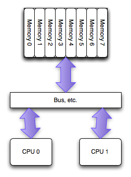
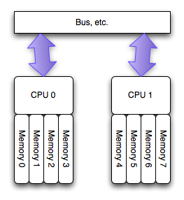

# Ceph使用NUMA
## NUMA简介
NUMA技术是解决多核架构下CPU访问内存的一个硬件方案，在了解NUMA之前，先看看什么是UMA。

UMA：


上图是UMA的内存访问示意图，任意cpu访问任意内存的代价是一样的，都需要经过**总线**进行存取。

NUMA：


上图是NUMA的内存访问示意图，CPU0和CPU1访问本地内存时可以不经过总线直接访问以获得低延迟的优势，跨越Numa-Node访问的延迟较高。

**确定本机是否支持numa**
``` sh
# dmesg -T|grep -i numa
[Mon Sep 25 16:51:24 2017] NUMA: Initialized distance table, cnt=2
[Mon Sep 25 16:51:24 2017] Enabling automatic NUMA balancing. Configure with numa_balancing= or the kernel.numa_balancing sysctl
[Mon Sep 25 16:51:34 2017] pci_bus 0000:00: on NUMA node 0
[Mon Sep 25 16:51:34 2017] pci_bus 0000:80: on NUMA node 1
```

**使用numactl查看numa的设置，查看每个numa-node对应的cpu编号(编号含超线程)**
``` sh
# numactl --hardware
available: 2 nodes (0-1)
node 0 cpus: 0 1 2 3 4 5 6 7 8 9 20 21 22 23 24 25 26 27 28 29
node 0 size: 65133 MB
node 0 free: 46652 MB
node 1 cpus: 10 11 12 13 14 15 16 17 18 19 30 31 32 33 34 35 36 37 38 39
node 1 size: 65536 MB
node 1 free: 41994 MB
node distances:
node 0 1 
0: 10 21 
1: 21 10
```
上述输出中，可以看到有两个node及其对应的cpu编号。每个node管理的内存是63.6G左右，大概是全部内存128G的一半。

当某个node的内存用尽时，不会到其他node申请内存，该node会把自己管理的内存**swap到磁盘来释放内存**，此时会降低性能。
这就是**mysql和mongodb为何要关闭numa**的原因。mysql和mongodb都需要管理大量的内存(如整机内存的80%)来提升数据库的吞吐，numa-node方案导致其可用内存只有整机的一半，即使有内存空闲，也会导致swap发生，这对数据库的性能是不利的。

**NUMA对ceph性能的提升原因**
对于ceph而言，每个ceph进程占用内存较少(4G左右)，绑定ceph进程到指定的numa-node，进程将被调度到该node，这样内存访问总是在node内，降低了内存的访问延迟，从而提升性能。
需要注意的是，numa方案在all nvme array时有效果，在hdd和sata ssd时的提升不明显，这是因为该场景下，io的时延为主要矛盾，跨numa-node访问影响有限。

## Ceph配置
**1. numacrl --hardware查看cpu与node的关系**
以上述为例，有两个node，分别管理[0-9, 20-29]/[10-19,30-39]两组cpu。

**2. 复制/usr/lib/systemd/system/ceph-osd@.service，保存为两份**
分别为/usr/lib/systemd/system/ceph-osd-n0@.service，/usr/lib/systemd/system/ceph-osd-n1@.service，在ceph-osd-n0@.service的[Service]中增加一行CPUAffinity= 0 1 2 3 4 5 6 7 8 9 20 21 22 23 24 25 26 27 28 29，保存。在ceph-osd-n1@.service中的[Service]中增加一行CPUAffinity= 10 11 12 13 14 15 16 17 18 19 30 31 32 33 34 35 36 37 38 39，保存。

**3. 编写批量的启动脚本**

for x in {0..10};
do
    if [ 0 -eq `expr $x % 2 ` ];then
        ssh afa0 systemctl $1 ceph-osd-n0@$x
    else
        ssh afa0 systemctl $1 ceph-osd-n1@$x
    fi
done

**4. 确认设置成功**
``` sh 
# for x in $(pgrep ceph-osd); do taskset -pc $x; done
pid 50411's current affinity list: 0-9,20-29
pid 50487's current affinity list: 10-19,30-39
pid 50564's current affinity list: 0-9,20-29
pid 50640's current affinity list: 10-19,30-39
pid 50711's current affinity list: 0-9,20-29
pid 50783's current affinity list: 10-19,30-39
pid 62648's current affinity list: 0-9,20-29
pid 62679's current affinity list: 10-19,30-39
pid 62714's current affinity list: 0-9,20-29
pid 62747's current affinity list: 10-19,30-39
pid 62828's current affinity list: 0-9,20-29
pid 62884's current affinity list: 10-19,30-39
pid 62941's current affinity list: 0-9,20-29
pid 62998's current affinity list: 10-19,30-39

```
