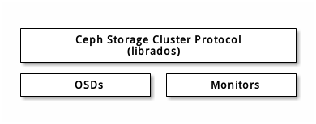
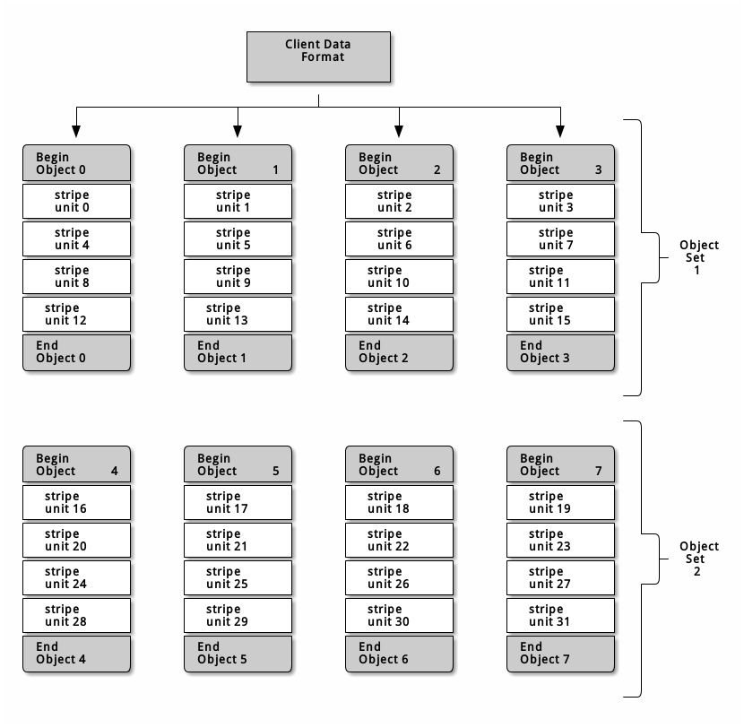

# Ceph协议
Ceph客户端用原生协议和存储集群交互，Ceph把此功能封装进了**librados**库，这样你就能创建自己的定制客户端了，下图描述了基本架构。

## 原生协议和 librados
现代程序都需要可异步通讯的简单对象存储接口。
Ceph存储集群提供了一个有异步通讯能力的简单对象存储接口，此接口提供了直接、并行访问集群对象的功能。
* 存储池操作；
* 快照和写时复制克隆；
* 读/写对象； - 创建或删除； - 整个对象或某个字节范围； - 追加或裁截；
* 创建/设置/获取/删除扩展属性；
* 创建/设置/获取/删除键/值对；
* 混合操作和双重确认；
* 对象类。

## 对象监视/通知
客户端可以注册对某个对象的持续兴趣，并使到**主OSD**的会话保持打开。
客户端可以发送一通知消息和载荷给所有监视者、并可收集监视者的回馈通知。
这个功能使得客户端可把任意对象用作同步/通讯通道。

## 数据条带化
存储设备都有吞吐量限制，它会影响性能和伸缩性，所以存储系统一般都支持条带化（把连续的信息分片存储于多个设备）以增加吞吐量和性能。

数据条带化最常见于RAID中， RAID中最接近Ceph条带化方式的是**RAID 0**、或者**条带卷**，Ceph的条带化提供了像RAID 0一样的吞吐量、像N路RAID镜像一样的可靠性、和更快的恢复。

Ceph提供了三种类型的客户端：**块设备**、**文件系统**和**对象存储**。
Ceph客户端把展现给用户的数据格式（一块设备映像、 REST 风格对象、 CephFS 文件系统目录）转换为可存储于Ceph存储集群的对象。

在Ceph存储集群内存储的那些对象是没条带化的。 Ceph对象存储、Ceph块设备、和Ceph文件系统把他们的数据条带化到Ceph存储集群内的多个对象，客户端通过librados直接写入Ceph存储集群前必须先**自己条带化**（和并行 I/O ）才能享受这些优势。 

**最简单的Ceph条带化形式就是一个对象的条带**。
Ceph客户端把**条带单元**写入Ceph存储的对象，直到对象容量达到上限，才会再创建另一个对象存储未完的数据。这种最简单的条带化对小的块设备映像、S3、Swift对象或CephFS文件来说也许足够了；然而这种简单的形式不能最大化Ceph在归置组间分布数据的能力，也就不能最大化性能。下图描述了条带化的最简形式：

如果要处理大尺寸图像、大S3或Swift对象（如视频）、或大的CephFS目录，你就能看到**条带化到一个对象集中的多个对象能带来显著的读/写性能提升**。
当客户端把条带单元并行地写入相应对象时，就会有明显的写性能，因为对象映射到了不同的归置组、并进一步映射到不同OSD，可以并行地以最大速度写入。到单一磁盘的写入受限于磁头移动（如：6ms寻道时间）和存储设备带宽（如：100MB/s）， Ceph把写入分布到多个对象（它们映射到了不同归置组 OSD），这样可减少每设备寻道次数、联合多个驱动器的吞吐量，以达到更高的写（或读）速度。

条带化独立于对象复制。因为CRUSH会在OSD间复制对象，数据条带是自动被复制的。

在下图中，客户端数据条带化到一个对象集（下图中的 object set 1 ），它包含4个对象，其中，第一个条带单元是object 0的stripe unit 0 、第四个条带是object 3的stripe unit 3 ，写完第四个条带，客户端要确认对象集是否满了。如果对象集没满，客户端再从第一个对象起写入条带（下图中的 object 0 ）；如果对象集满了，客户端就得创建新对象集（下图的 object set 2 ），然后从新对象集中的第一个对象（下图中的object 4）起开始写入第一个条带（stripe unit 16）。

三个重要变量决定着Ceph如何条带化数据：
* 对象尺寸： Ceph存储集群里的对象有最大可配置尺寸（如 2MB 、 4MB 等等），对象尺寸必须足够大以便容纳很多条带单元、而且应该是条带单元的整数倍。
* 条带宽度： 条带都有可配置的单元尺寸（如 64KB ）。 Ceph客户端把数据等分成适合写入对象的条带单元，除了最后一个。条带宽度应该是对象尺寸的分片，这样对象才能包含很多条带单元。
* 条带数量： Ceph客户端把一系列条带单元写入由条带数量所确定的一系列对象，这一系列的对象称为一个对象集。客户端写到对象集内的最后一个对象时，再返回到第一个。

把集群投入生产环境前要先测试条带化配置的性能，因为把数据条带化到对象中之后这些参数就不可更改了。

Ceph 客户端把数据等分为条带单元并映射到对象后，用 CRUSH 算法把对象映射到归置组、归置组映射到 OSD ，然后才能以文件形式存储到硬盘上。