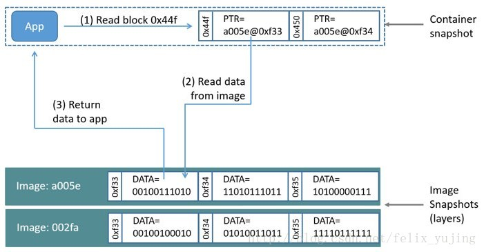

# devicemapper
## Device Mapper简介
[Device Mapper](../../../linux/devicemapper.md)是Linux系统中基于内核的**高级卷管理技术框架**。
它是内核中支持逻辑卷管理的通用设备映射机制，为实现**块设备驱动**提供了一个高度模块化的内核架构，包含三个重要的对象概念：Mapped Device、Mapping Table、Target device。

## Docker的devicemapper驱动
Docker的**devicemapper**存储驱动基于该框架的**thin-provisioning**和**snapshotting**功能来实现镜像和容器的管理。

**devicemapper驱动**将每一个Docker镜像和容器存储在自身具有**精简置备(thin-provisioned)**、**写时拷贝(copy-on-write)**和**快照功能(snapshotting)**的**虚拟设备**上。

由于Device Mapper技术是在**块(block)层面**而非文件层面，所以Docker Engine的devicemapper存储驱动使用的是**块设备**来存储数据而非文件系统，有着thin provisioning和copy-on-write的特点。

* thin provisioning: 自动精简配置，简单的说就是在需要的时候分配所需的最小空间（与此相对的传统的存储配置模型被称为厚存储配置Fat provisioning，存储空间的分配都是超过目前的需求的，从而导致的一个问题就是存储利用率低下）。
* copy-on-write：写时复制技术，简单理解就是内容发生变化才进行复制。


## How the devicemapper storage driver works
### 查看
使用**lsblk**命令可以从操作系统的角度查看**设备及其pools**：

``` sh 
$ sudo lsblk

NAME                    MAJ:MIN RM  SIZE RO TYPE MOUNTPOINT
xvda                    202:0    0    8G  0 disk
└─xvda1                 202:1    0    8G  0 part /
xvdf                    202:80   0  100G  0 disk
├─docker-thinpool_tmeta 253:0    0 1020M  0 lvm
│ └─docker-thinpool     253:2    0   95G  0 lvm
└─docker-thinpool_tdata 253:1    0   95G  0 lvm
  └─docker-thinpool     253:2    0   95G  0 lvm
```
使用**mount**命令可以查看Docker正在使用的monut-point：
``` sh
$ mount |grep devicemapper
/dev/xvda1 on /var/lib/docker/devicemapper type xfs (rw,relatime,seclabel,attr2,inode64,noquota)
```

当使用**devicemapper**时，Docker把镜像和层的内容存储在thinpool中，然后挂载到/var/lib/docker/devicemapper/的子目录下暴露给容器使用。

### 磁盘上的镜像和容器层
/var/lib/docker/devicemapper/metadata/目录下包含的是Devicemapper的配置本身和每个镜像和容器层的元信息。
驱动devicemapper使用snapshots，metadata也包含snapshots的信息。文件是JSON格式的。

/var/lib/devicemapper/mnt/目录包含每个镜像和容器层的mount point。Image layerd mount points are empty, but a container’s mount point shows the container’s filesystem as it appears from within the container。

### 镜像的分层和共享
驱动devicemapper使用专用的块存储而不是格式化的文件系统，并且在copy-on-write (CoW)操作中为了最大化性能，在块层面操作文件。
#### Snapshots
驱动devicemapper的另一个特征是它使用snapshots（有时也称为thin devices或者虚拟设备），快照仅仅存储每个层的擦差异部分，所有非常小非常轻量。

Snapshots提供很多的优点：
* 容器间共享的layers只存储一份，除非它是可写的。
* Snapshots是copy-on-write策略的实现。仅当一个容器要**改变或者删除**一个文件时，这个文件才会被拷贝到容器的读写层中。
* 因为devicemapper工作在块层面，所有一个读写层的多个块可以同时修改。
* Snapshots可以使用OS层面的back工具进行备份。复制/var/lib/docker/devicemapper/就可以了。

#### Devicemapper workflow
当以devicemapper作为storage driver启动Docker时，所有镜像和容器层相关的对象都存储在/var/lib/docker/devicemapper/，该目录backed by一个或者多个块设备：loopback设备（仅作测试）或者物理磁盘。
* Base device是最底层的对象，thin pool自身，可以通过docker info命令检查。它包含一个文件系统。Base device是所有镜像和容器层的起点。Base device是一个Device Mapper的实现，不是一个Docker层。
* 关于base device和镜像或者容器层的元数据以JSON格式保存在目录/var/lib/docker/devicemapper/metadata/。这些层是Copy-on-Write的快照。
* 每个容器的可写层mount到/var/lib/docker/devicemapper/mnt/目录下的一个挂载点上。每个只读的镜像层和停止运行的容器层都有一个空的目录。

每个镜像层都是它下层的一个快照。每个镜像的最底一层是pool中的base device的快照。当运行一个容器时，容器是它运行的镜像的一个快照。下图中主机上运行了了2个容器，一个是ubuntu容器一个是busybox容器。


使用devicemapper存储生成镜像大致按照下面的流程： 
1. devicemapper驱动从块设备创建一个小的存储池（a thin pool） 
2. 创建一个带有文件系统，如extfs等，的基础设备（base device） 
3. 每个新的镜像（或镜像层）都是base device的一个快照（snapshot）

devicemapper存储方式下，**容器层都是从镜像生成的快照**，快照里存储着所有对容器的更新。当数据被写入容器的时候，devicemapper按需从池中分配空间。

从上图可以看出，
**每个镜像层都是它下面一层的快照**。
**每个镜像的最下面一层的镜像则是池中base device的快照**。
需要注意的是，base device属于Device Mapper的一部分，并不是docker的镜像层。

## How container reads and writes work with devicemappe
### 读文件
官网上读操作的说明如下：



1. 应用请求读取容器中的0x44f块区，因为容器是镜像的一个简单快照，并没有数据，只有一个指针，指向镜像层存储数据的地方。 
2. 存储驱动根据指针，到镜像快照的a005e镜像层寻找0xf33块区 
3. devicemapper从镜像快照拷贝0xf33的内容到容器的内存中 
4. 存储驱动最后将数据返回给请求的应用

### 写文件
当对容器中的大文件做一个小的改动的时候，devicemapper不会复制这整个文件，而是**只拷贝被修改的块区**。
每个块区的大小为64KB。
* 写新数据: 例如，写56KB大小的新数据到一个容器：
 1. 应用发出一个要写56KB的新数据到容器的请求。
 2. 根据按需分配，将分配一个新的64KB的块区分配给容器的快照。
 3. 数据被写入到新分配的块区中。
* 覆写已有数据：
 1. 应用发出一个修改容器中数据的请求。
 2. copy-on-write操作将定位到需要更新的块区。
 3. 然后分配新的空块区给容器快照，并复制数据到新分配的块区。
 4. 接着，在新块区中对数据进行修改。
容器中的应用对发生的allocate-on-demand和copy-on-write是无感知的。

## devicemapper的配置
devicemapper是RHEL下Docker Engine的默认存储驱动，它有两种配置模式:**loop-lvm**和**direct-lvm**。
* loop-lvm：默认的模式，它使用OS层面稀疏文件(sparse file)来构建精简池(thin pool)。该模式主要是设计出来让Docker能够简单的被**开箱即用(out-of-the-box)**而无需额外的配置。但如果是在生产环境部署Docker，官方明文不推荐使用该模式。
* direct-lvm：Docker推荐的生产环境的推荐模式，使用**块设备来构建精简池**来存放镜像和容器的数据。

假设/dev/mapper/docker-thinpool是已建好的lvm的逻辑卷，可以配置docker daemon的运行选项如下：

```
--storage-driver=devicemapper --storage-opt=dm.thinpooldev=/dev/mapper/docker-thinpool --storage-opt=dm.use_deferred_removal=true --storage-opt=dm.use_deferred_deletion=true
```
### devicemapper在主机上的结构
使用lsblk命令可以查看设备文件和devicemapper在设备文件上创建的pool： 


对应上面接口的层次如下：


可以看出，名为Docker-202:1-1032-pool的pool横跨在data和metadata设备之上。pool的命名规则为：
```
Docker-主设备号:二级设备号-inode号-pool
```

docker 1.10和以后的版本，在/var/lib/docker目录下不再采用镜像层ID来关联目录名了，有另外两个比较重要的目录： 
* /var/lib/docker/devicemapper/mnt 包含镜像和容器层的挂载目录。
* /var/lib/docker/devicemapper/metadata 目录包含每个镜像层和容器快照的json格式的文件。

另外，当数据的逻辑卷要满的时候，可以给pool进行扩容，具体操作看官网。

## devicemapper的性能
### allocate-on-demand
每当应用有新数据要写入容器时，都要从pool中去定位空的块区并映射给容器。
因为所有块区都是64KB的，小于64KB的数据也会分配一个块区；大于64B的数据则会分配多个块区。
所以，特别是当发生**很多小的写操作**时，就会比较影响容器的性能。

### copy-on-write
每当容器第一次更新已有的数据时，devicemapper存储驱动都要执行copy-on-write操作。
这个操作是从镜像快照复制数据到容器快照，这对容器性能还是有比较明显的性能影响的。
当容器发生很多小64KB的写操作时，devicemapper的性能会比AUFS要差。

## 其它
### 所使用的mode 
默认情况下，devicemapper使用的是loop-lvm模式，这种模式使用的是sparse files，性能比较低。
生产环境建议使用direct-lvm模式，这种模式存储驱动直接写数据到块设备。 
### 使用高速存储 
如果希望更好的性能，可以将Data file和Metadata file放到SSD这样的高速存储上。 
### 内存使用 
devicemapper并不是一个有效使用内存的存储驱动。
当一个容器运行n个时，它的文件也会被拷贝n份到内存中，这对docker宿主机的内存使用会造成明显影响。
因此，**devicemapper存储驱动可能并不是PaaS和其它高密度使用型的最好选择**。
对于写操作较大的，可以采用挂载data volumes。使用data volumes可以绕过存储驱动，从而不受thin provisioning和copy-on-write产生的负面影响。