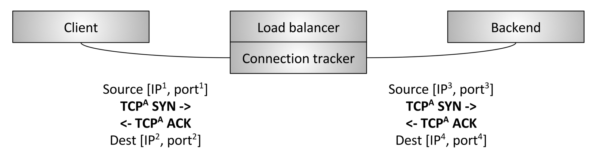
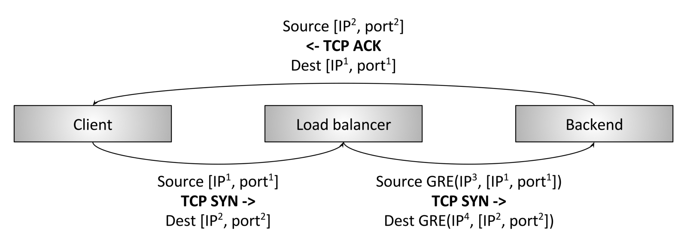
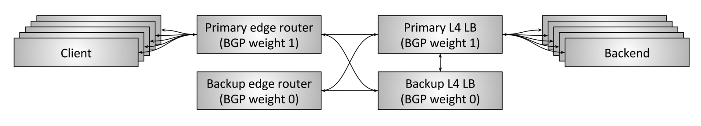
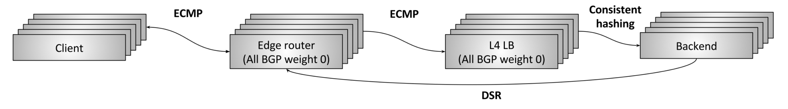

# 四层负载均衡
在一个edge deployment中，通常把一个**专用的L4负载均衡器**置于L7负载均衡器之前：
因为L7负载均衡器需要执行更多的分析、转换和应用流量的路由，与L4相比，L7只能处理相对一部分原始流量（packets/second、bytes/second）。同行使用L4处理某种类型的DoS攻击（比如SYN floods，generic packet flood attacks）。

## TCP/UDP termination load balancers

Figure 8: L4 termination load balancer

两个独立TCP连接：客户端和负载均衡器之间；均衡器和backend之间。

## TCP/UDP passthrough load balancers

Figure 9: L4 passthrough load balancer

In this type of load balancer, the TCP connection is not terminated by the load balancer. Instead, packets for each connection are forwarded on to a selected backend after connection tracking and Network Address Translation (NAT) take place. 

First, let’s define connection tracking and NAT:
* Connection tracking: Is the process of keeping track of the state of all active TCP connections. This includes data such as whether the handshake has completed, whether a FIN has been received, how long the connection has been idle, which backend has been selected for the connection, etc.
* NAT: NAT is the process of using connection tracking data to alter IP/port information of packets as they traverse the load balancer.

Using both connection tracking and NAT, the load balancer can passthrough mostly raw TCP traffic from the client to the backend.

For example, let’s say the client is talking to 1.2.3.4:80 and the selected backend is located at 10.0.0.2:9000. The client TCP packets will arrive at the load balancer at 1.2.3.4:80. The load balancer will then swap the destination IP and port of the packet with 10.0.0.2:9000. It will also swap the source IP of the packet with the IP address of the load balancer. Thus, when the backend responds on the TCP connection, the packets will go back to the load balancer, where connection tracking takes place and NAT can happen again in the reverse direction.

Why would this type of load balancer be used in place of the termination load balancer described in the previous section given that it is more complicated? A few reasons:
* Performance and resource usage: Because passthrough load balancers are not terminating TCP connections, they do not need to buffer any TCP connection window. The amount of state stored per connection is quite small and is generally accessed via efficient hash table lookups. Because of this, passthrough load balancers can typically handle a substantially larger number of active connections and packets per second (PPS) than a terminating load balancer.
* Allows backends to perform customized congestion control: TCP congestion control is the mechanism by which endpoints on the Internet throttle sending data so as to not overwhelm available bandwidth and buffers. Since a passthrough load balancer is not terminating the TCP connection, it does not participate in congestion control. This fact allows backends to use different congestion control algorithms depending on their application use case. It also allows easier experimentation on congestion control changes (e.g., the recent BBR rollout).
* Forms the baseline for Direct server return (DSR) and clustered L4 load balancing: Passthrough load balancing is required for more advanced L4 load balancing techniques such as DSR and clustering with distributed consistent hashing

## Direct server return (DSR)

Figure 10: L4 Direct server return (DSR)

DSR builds on the passthrough load balancer described in the previous section. DSR is an optimization in which only ingress/request packets traverse the load balancer. Egress/response packets travel around the load balancer directly back to the client. 

The primary reason why it’s interesting to perform DSR is that in many workloads, response traffic dwarfs request traffic (e.g., typical HTTP request/response patterns). Assuming 10% of traffic is request traffic and 90% of traffic is response traffic, if DSR is being used a load balancer with 1/10 of the capacity can meet the needs of the system. 

Since historically load balancers have been extremely expensive, this type of optimization can have substantial implications on system cost and reliability (less is always better). DSR load balancers extend the concepts of the passthrough load balancer with the following:
* The load balancer still typically performs partial connection tracking. Since response packets do not traverse the load balancer, the load balancer will not be aware of the complete TCP connection state. However, the load balancer can strongly infer the state by looking at the client packets and using various types of idle timeouts.
* Instead of NAT, the load balancer will typically use Generic Routing Encapsulation (GRE) to encapsulate the IP packets being sent from the load balancer to the backend. Thus, when the backend receives the encapsulated packet, it can decapsulate it and know the original IP address and TCP port of the client. This allows the backend to respond directly to the client without the response packets flowing through the load balancer.
* An important part of the DSR load balancer is that the backend participates in the load balancing. The backend needs to have a properly configured GRE tunnel and depending on the low level details of the network setup may need its own connection tracking, NAT, etc.

Note that in both the passthrough load balancer and DSR load balancer designs there are a large variety of ways that connection tracking, NAT, GRE, etc. can be setup across the load balancer and the backend. 

## Fault tolerance via high availability pairs

Figure 11: L4 fault tolerance via HA pairs and connection tracking

Historically, L4 load balancers have been hardware devices purchased from the typical vendors (Cisco, Juniper, F5, etc.). 
These devices are extremely expensive and handle a large amount of traffic. 
In order to avoid a single load balancer failure severing all connections and leading to a substantial application outage, load balancers have typically been deployed in high availability pairs as shown in figure 11. 
A typical HA load balancer setup has the following design:
* A pair of HA edge routers service some number of virtual IPs (VIP). These edge routers announce the VIPs using Border Gateway Protocol (BGP). The primary edge router has a higher BGP weight than the backup, so at steady state it is serving all traffic. (BGP is an extremely complicated protocol; for the purpose of this article, just consider BGP a mechanism by which network devices announce that they are available to take traffic from other network devices and that each link can have a weight that prioritizes link traffic).
* Similarly, the primary L4 load balancer announces itself to the edge routers with a higher BGP weight than the backup, so at steady state it is serving all traffic.
* The primary load balancer is cross-connected to the backup, and shares all of its connection tracking state. Thus, if the primary dies, the backup can take over handling all active connections.
* The two edge routers and the two load balancers are all cross-connected. This means that if one of the edge routers or one of the load balancers dies, or has its BGP announcement withdrawn for some other reason, the backup can take over serving all traffic.

The above setup is how many high traffic Internet applications are still served today. However, there are substantial downsides to the above approach:
* VIPs must be correctly sharded across HA load balancer pairs taking into account capacity usage. If a single VIP grows beyond the capacity of a single HA pair, the VIP needs to be split into multiple VIPs.
* The resource usage of the system is poor. 50% of capacity sits idle at steady state. Given that historically hardware load balancers are extremely expensive, this leads to a substantial amount of idle capital.

Modern distributed system design prefers greater fault tolerance than active/backup provides. e.g., optimally, a system should be able to suffer multiple simultaneous failures and keep running. 
An HA load balancer pair is susceptible to total failure if both the active and backup load balancer die at the same time.
Proprietary large hardware devices from vendors are extremely expensive and lead to vendor lock-in. It is generally desirable to replace these hardware devices with horizontally scalable software solutions built using commodity compute servers.

## Fault tolerance and scaling via clusters with **distributed consistent hashing**

Figure 12: L4 fault tolerance and scaling via clustered load balancers and consistent hashing

Mitigate all of the downsides of the HA pair design described in the previous section.
Move away from proprietary hardware load balancers from vendors to commodity software solutions built using standard compute servers and NICs.

This L4 load balancer design is best referred to as fault tolerance and scaling via clustering and distributed consistent hashing. It works as follows:

* N edge routers announce all Anycast VIPs at an identical BGP weight. Equal-cost multi-path routing (ECMP) is used to ensure that in general, all packets from a single flow arrive at the same edge router. A flow is typically the 4-tuple of source IP/port and destination IP/port. (In short, ECMP is a way of distributing packets over a set of identically weighted network links using consistent hashing). Although the edge routers themselves don’t particularly care which packets arrive where, in general it is preferred that all packets from a flow traverse the same set of links so as to avoid out of order packets which degrade performance.
* N L4 load balancer machines announce all VIPs at an identical BGP weight to the edge routers. Again using ECMP, the edge routers will generally select the same load balancer machine for a flow.
* Each L4 load balancer machine will typically perform partial connection tracking, and then use consistent hashing to select a backend for the flow. GRE is used to encapsulate the packets sent from the load balancer to the backend.

DSR is then used to send packets directly from the backend to the client via the edge routers.
The actual consistent hashing algorithm used by the L4 load balancer is an area of active research. There are tradeoffs primarily around equalizing load, minimizing latency, minimizing disruption during backend changes, and minimizing memory overhead.

Let’s see how the above design mitigates all of the downsides of the HA pair approach:
* New edge routers and load balancer machines can be added as needed. Consistent hashing is used at every layer to decrease the number of affected flows as much as possible when new machines are added.
* The resource usage of the system can be run as high as desired while maintaining sufficient burst margins and fault tolerance.
* Both the edge routers and load balancers can now be built using commodity hardware at a tiny fraction of the cost of traditional hardware load balancers.

One question that is typically asked about this design is “why don’t the edge routers talk directly to the backends via ECMP? Why do we need the load balancer at all?” The reasons for this are primarily around DoS mitigation and backend operational ease. Without the load balancer, each backend would have to participate in BGP and would have a substantially harder time performing rolling deploys.

