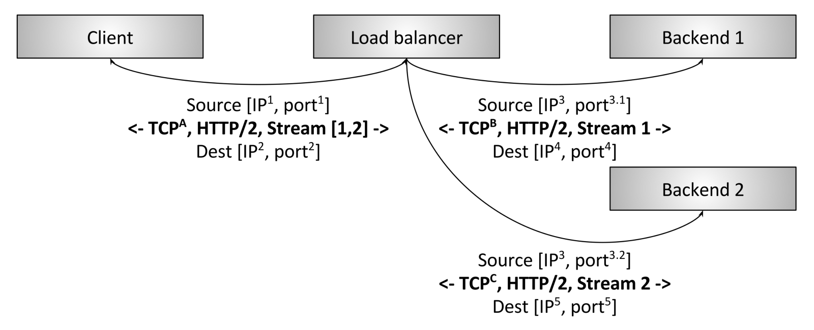

# 网络负载均衡（network load balancing）和代理（proxying）
## 负载均衡
*Wikipedia*对负载均衡（load balancing）定义如下：
``` english
In computing, load balancing improves the distribution of workloads across multiple computing resources, such as computers, a computer cluster, network links, central processing units, or disk drives. Load balancing aims to optimize resource use, maximize throughput, minimize response time, and avoid overload of any single resource. Using multiple components with load balancing instead of a single component may increase reliability and availability through redundancy. Load balancing usually involves dedicated software or hardware, such as a multilayer switch or a Domain Name System server process.
```
从上面的定义可以看出，负载均衡牵涉到计算的方方面面，不止是网络。
操作系统使用负载均衡把任务调度到CPU群组上。
容器编排其，比如kubernetes，使用负载均衡把任务调度到计算机集群上。
网络负载均衡器使用负载均衡把网络任务调度到不同的后端（backends）上。

Figure 1: Network load balancing overview

图1是网络负载均衡的一个概况图（high level overview）。
多个客户端正在向多个服务后端请求资源。
一个负载均衡器位于客户端和服务端之间。从大的层面看处理一下几个主要问题：
* Service discovery：系统中哪些backends是可用的？可用服务的访问地址是什么？负载均衡器如何与backends交互？
* Health checking：哪些backends目前是健康的，可以接受请求？
* Load balancing： 通过什么策略把请求均衡到各个可用的服务后端（backends）？

在一个分布式系统中正确的使用负载均衡，可以带来以下好处：
* naming abstraction: 客户端不需要知道每个backends的地址，客户端只需要通过预定义的机制获取负载均衡器的地址，负载均衡器负责选择合适的backends服务。预先定义的机制比如DNS/IP/port等。
* Fault tolerance： 通过健康检查和各种算法技术，负载均衡器可以自动忽略宕机或者高负载的后端。从而为系统维护人员赢得时间修复宕机的后端。
* Cost and performance benefits。

## 负载均衡器和代理
在谈负载均衡器时，在工业界，负载均衡器和代理经常混用。
* 并非所有的代理都是负载均衡器。
* 大多数代理都可以进行负载均衡。

### L4负载均衡(connection/session)
负载均衡一般工作在两个层次上：
* L4
* L7

Figure 2: TCP L4 termination load balancing

图2是一个传统的L4 TCP负载均衡器。
本例中，客户端和负载均衡器之间建立一条TCP连接。负载均衡器terminiate该连接（对客户端的SYN包进行响应），然后选择一个backend，和backend建立一条新的连接（发送一个SYN包）。

典型的L4负载均衡器工作在L4 TCP/UDP连接上，简单的将bytes来回搬运，确保来自同一条连接的bytes送到同一个backend。
L4负载均衡器对其搬运的bytes的应用含义一无所知。
这些bytes可以是HTTP, Redis, MongoDB等任何应用层协议。

###　L7负载均衡 (application)
L4负载均衡简单并且使用很广。
但是L4负载均衡存在负载不均的问题，比如：
两个gRPC/HTTP2客户端要和backend通信。他们通过一个L4负载均衡器。
L4负载均衡器针对每一个进来的TCP连接建立一条出去的TCP连接到后端。
然后，Client A每分钟发送一个请求，Client B每秒钟发送50个请求。

在这种情况下，接受Client A请求的backend压力时接受Client B请求的后端的3000倍。

负载严重不均衡。

在所有multiplexing，kept-alive协议中都存在这个问题。


Figure 3: HTTP/2 L7 termination load balancing

图3是一个L7 HTTP/2负载均衡器。
客户端发起和负载均衡器建立一条HTTP/2的TCP连接。
负载均衡器然后建立2条后台连接。
当客户端向负载均衡器发送两个HTTP/2 stream时，stream 1被发送到backend 1，同时stream2被发送到backend2。