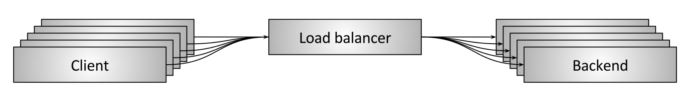
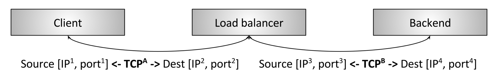

# 网络负载均衡（network load balancing）和代理（proxying）
## 负载均衡
*Wikipedia*对负载均衡（load balancing）定义如下：
``` english
In computing, load balancing improves the distribution of workloads across multiple computing resources, such as computers, a computer cluster, network links, central processing units, or disk drives. Load balancing aims to optimize resource use, maximize throughput, minimize response time, and avoid overload of any single resource. Using multiple components with load balancing instead of a single component may increase reliability and availability through redundancy. Load balancing usually involves dedicated software or hardware, such as a multilayer switch or a Domain Name System server process.
```
从上面的定义可以看出，负载均衡牵涉到计算的方方面面，不止是网络。
操作系统使用负载均衡把任务调度到CPU群组上。
容器编排其，比如kubernetes，使用负载均衡把任务调度到计算机集群上。
网络负载均衡器使用负载均衡把网络任务调度到不同的后端（backends）上。

Figure 1: Network load balancing overview

图1是网络负载均衡的一个概况图（high level overview）。
多个客户端正在向多个服务后端请求资源。
一个负载均衡器位于客户端和服务端之间。从大的层面看处理一下几个主要问题：
* Service discovery：系统中哪些backends是可用的？可用服务的访问地址是什么？负载均衡器如何与backends交互？
* Health checking：哪些backends目前是健康的，可以接受请求？
* Load balancing： 通过什么策略把请求均衡到各个可用的服务后端（backends）？

在一个分布式系统中正确的使用负载均衡，可以带来以下好处：
* naming abstraction: 客户端不需要知道每个backends的地址，客户端只需要通过预定义的机制获取负载均衡器的地址，负载均衡器负责选择合适的backends服务。预先定义的机制比如DNS/IP/port等。
* Fault tolerance： 通过健康检查和各种算法技术，负载均衡器可以自动忽略宕机或者高负载的后端。从而为系统维护人员赢得时间修复宕机的后端。
* Cost and performance benefits。

## 负载均衡器和代理
在谈负载均衡器时，在工业界，负载均衡器和代理经常混用。
* 并非所有的代理都是负载均衡器。
* 大多数代理都可以进行负载均衡。

### L4负载均衡(connection/session)
负载均衡一般工作在两个层次上：
* L4
* L7

Figure 2: TCP L4 termination load balancing

图2是一个传统的L4 TCP负载均衡器。
本例中，客户端和负载均衡器之间建立一条TCP连接。负载均衡器terminiate该连接（对客户端的SYN包进行响应），然后选择一个backend，和backend建立一条新的连接（发送一个SYN包）。

典型的L4负载均衡器工作在L4 TCP/UDP连接上，简单的将bytes来回搬运，确保来自同一条连接的bytes送到同一个backend。
L4负载均衡器对其搬运的bytes的应用含义一无所知。
这些bytes可以是HTTP, Redis, MongoDB等任何应用层协议。

###　L7负载均衡 (application)
L4 load balancing is simple and still sees wide use. What are the shortcomings of L4 load balancing that warrant investment in L7 (application) load balancing? Take the following L4 specific case as an example:
Two gRPC/HTTP2 clients want to talk to a backend so they connect through an L4 load balancer.
The L4 load balancer makes a single outgoing TCP connection for each incoming TCP connection, resulting in two incoming and two outgoing connections.
However, client A sends 1 request per minute (RPM) over its connection, while client B sends 50 requests per second (RPS) over its connection.
In the previous scenario, the backend selected to handle client A will be handling approximately 3000x less load then the backend selected to handle client B! This is a large problem and generally defeats the purpose of load balancing in the first place. Note also that this problem happens for any multiplexing, kept-alive protocol. (Multiplexing means sending concurrent application requests over a single L4 connection, and kept-alive means not closing the connection when there are no active requests). All modern protocols are evolving to be both multiplexing and kept-alive for efficiency reasons (it is generally expensive to create connections, especially when the connections are encrypted using TLS), so the L4 load balancer impedance mismatch is becoming more pronounced over time. This problem is fixed by the L7 load balancer.

Figure 3: HTTP/2 L7 termination load balancing
Figure 3 shows an L7 HTTP/2 load balancer. In this case, the client makes a single HTTP/2 TCP connection to the load balancer. The load balancer then proceeds to make two backend connections. When the client sends two HTTP/2 streams to the load balancer, stream 1 is sent to backend 1 while stream 2 is sent to backend 2. Thus, even multiplexing clients that have vastly different request loads will be balanced efficiently across the backends. This is why L7 load balancing is so important for modern protocols. (L7 load balancing yields a tremendous amount of additional benefits due to its ability to inspect application traffic, but that will be covered in more detail below).
L7 load balancing and the OSI model
As I said above in the section on L4 load balancing, using the OSI model for describing load balancing features is problematic. The reason is that L7, at least as described by the OSI model, itself encompasses multiple discrete layers of load balancing abstraction. e.g., for HTTP traffic consider the following sublayers:
Optional Transport Layer Security (TLS). Note that networking people argue about which OSI layer TLS falls into. For the sake of this discussion we will consider TLS L7.
Physical HTTP protocol (HTTP/1 or HTTP/2).
Logical HTTP protocol (headers, body data, and trailers).
Messaging protocol (gRPC, REST, etc.).
A sophisticated L7 load balancer may offer features related to each of the above sublayers. Another L7 load balancer might only have a small subset of features that place it in the L7 category. In short, the L7 load balancer landscape is vastly more complicated from a feature comparison perspective than the L4 category. (And of course this section has just touched on HTTP; Redis, Kafka, MongoDB, etc. are all examples of L7 application protocols that benefit from L7 load balancing).
