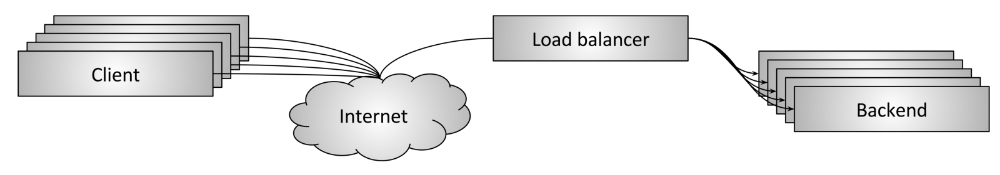
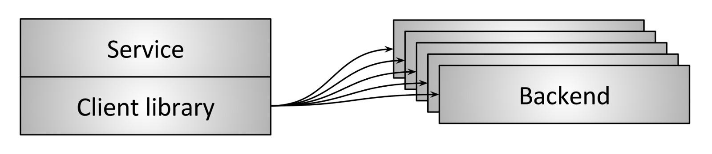
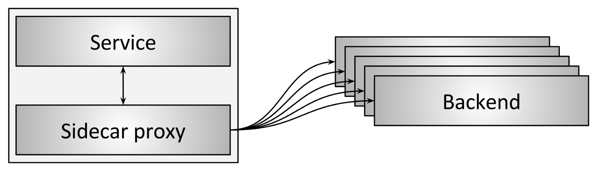

# 负载均衡器的部署拓扑
## Middle proxy

Figure 4: Middle proxy load balancing topology

图4所示的部署方式：middle proxy是最常见的。
比如，硬件方案如：Cisco, Juniper, F5等；云部署方案如Amazon的ALB和NLB，Google的云负载均衡器（Cloud Load Balancer)，以及纯软件部署方案HAProxy和NGINX等。

* 优势：对用户简单。用户通过DNS连接到负载均衡器即可，不需要关系其它的。
* 劣势：proxy是个单点；扩展的瓶颈；黑盒子，难以定位问题：不知道是客户端、物理链路还是proxy或者backend的问题。 

## Edge proxy

Figure 5: Edge proxy load balancing topology

The edge proxy topology shown in figure 5 is really just a variant of the middle proxy topology in which the load balancer is accessible via the Internet. In this scenario the load balancer typically must provide additional “API gateway” features such as TLS termination, rate limiting, authentication, and sophisticated traffic routing. The pros and cons of the edge proxy are the same as the middle proxy. A caveat is that it is typically unavoidable to deploy a dedicated edge proxy in a large Internet-facing distributed system. Clients typically need to access the system over DNS using arbitrary network libraries that the service owner does not control (making the embedded client library or sidecar proxy topologies described in the following sections impractical to run directly on the client). Additionally, for security reasons it is desirable to have a single gateway by which all Internet-facing traffic ingresses into the system.

## Embedded client library

Figure 6: Load balancing via embedded client library

To avoid the single point of failure and scaling issues inherent in middle proxy topologies, more sophisticated infrastructures have moved towards embedding the load balancer directly into services via a library, as shown in figure 6. Libraries vary greatly in supported features, but some of the most well known and feature-rich in this category are Finagle, Eureka/Ribbon/Hystrix, and gRPC (loosely based on an internal Google system called Stubby). The main pro of a library based solution is that it fully distributes all of the functionality of the load balancer to each client, thus removing the single point of failure and scaling issues previously described. The primary con of a library-based solution is the fact that the library must be implemented in every language that an organization uses. Distributed architectures are becoming increasingly “polyglot” (multilingual). In this environment, the cost of reimplementing an extremely sophisticated networking library in many different languages can become prohibitive. Finally, deploying library upgrades across a large service architecture can be extremely painful, making it highly likely that many different versions of the library will be running concurrently in production, increasing operational cognitive load.
With all of that said, the libraries mentioned above have been successful for companies that have been able to limit programming language proliferation and overcome library upgrade pains.

## Sidecar proxy

Figure 7: Load balancing via sidecar proxy

A variant of the embedded client library load balancer topology is the sidecar proxy topology shown in figure 7. In recent years, this topology has been popularized as the “service mesh.” The idea behind the sidecar proxy is that at the cost of a slight latency penalty via hopping to a different process, all of the benefits of the embedded library approach can be obtained without any programming language lock-in. The most popular sidecar proxy load balancers as of this writing are Envoy, NGINX, HAProxy, and Linkerd. For a more detailed treatment of the sidecar proxy approach please see my blog post introducing Envoy as well as my post on the service mesh data plane vs. control plane.

## Summary and pros/cons of the different load balancer topologies
* The middle proxy topology is typically the easiest load balancing topology to consume. It falls short due to being a single point of failure, scaling limitations, and black box operation.
* The edge proxy topology is similar to middle proxy but typically cannot be avoided.
* The embedded client library topology offers the best performance and scalability, but suffers from the need to implement the library in every language as well as the need to upgrade the library across all services.
* The sidecar proxy topology does not perform as well as the embedded client library topology, but does not suffer from any of the limitations.

Overall, I think the sidecar proxy topology (service mesh) is gradually going to replace all other topologies for service-to-service communication. The edge proxy topology will always be required prior to traffic entering the service mesh.
