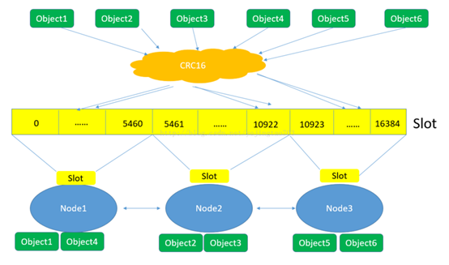

# Redis集群
## 概述
Redis主从复制和哨兵模式比较完善的解决了数据的高可用问题。
但是Redis目前还面临着2个问题：
* 存储能力受到单机存储的限制。
* 写操作只能针对master节点进行；负载均衡只能针对读操作，不能针对写操作。

因此，Redis3.0开始引入了Redis Cluster。

集群由多个节点(Node)组成，Redis的数据分布在这些节点中。
集群中的节点分为主节点和从节点：
* `主节点`负责读写请求和集群信息的维护。
* `从节点`只进行主节点数据和状态信息的复制。

集群的作用可以归纳为两点：
* 数据分区：也称为数据分片，是集群最核心的功能。
集群将数据分散到多个节点，一方面突破了Redis单机内存大小的限制，存储容量大大增加；
另一方面每个主节点都可以对外提供读服务和写服务，大大提高了集群的响应能力。
* 高可用：集群支持主从复制和主节点的自动故障转移（与哨兵类似）。

## 集群搭建
* [redis命令搭建](cluster/cluster.sh)
* [ruby脚本搭建]
### 集群方案设计
* 高可用要求：至少3个主节点，且3个主节点不在一台物理机上。每个主节点至少一个从节点，且主从节点不在一台物理机上。所以至少6台节点。
* 数据量和访问量
* 节点数量限制：Redis官方给出的节点数量限制为1000——主要考虑节点间通信带来的消耗。
* 适度冗余

## 集群的基本原理
### 数据分区方案
衡量数据分区方案的优劣在于2点：
* 数据分布的均衡性
* 增减/删除节点时，对数据分布的影响（需要移动的数据量）
常见的分区方式：
* 哈希取余分区
* 一致性哈希分区
* 带虚拟节点的一致性哈希分区

Redis使用`带虚拟节点的一致性哈希分区`。
在使用了槽的一致性哈希分区中，`槽是数据管理和迁移的基本单位`。
槽解耦了数据和实际节点之间的关系，增加或删除节点对系统的影响很小。

槽的数量一般远小于2^32，远大于实际节点的数量；在Redis集群中，槽的数量为16384。

## 参考
https://www.cnblogs.com/kismetv/p/9853040.html