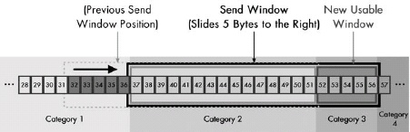

# TCP滑动窗口
相比UDP，TCP的传输质量要好，是可靠的数据传输。
TCP对于发送数据进行跟踪，这种数据管理协议提供了两大关键功能：

* 可靠性 保证数据确实到达目的地。如果未到达，能够发现并重传。
* 数据流控 管理数据的发送速率，以使接收设备不致于过载。

TCP提供了滑动窗口确认机制来完成上述两大关键功能。

## TCP面向流的滑动窗口确认机制
TCP将独立的字节数据当作流来处理。一次发送一个字节并接收一次确认显然是不可行的。即使重叠传输（即不等待确认就发送下一个数据），速度也还是会非常缓慢。

TCP消息确认机制如上图所示，首先，每一条消息都有一个识别编号，每一条消息都能够被独立地确认，因此同一时刻可以发送多条信息。

设备B定期发送给A一条发送限制参数，制约设备A一次能发送的消息最大数量。设备B可以对该参数进行调整，以控制设备A的数据流。

为了提高速度，TCP并没有按照字节单个发送而是将数据流划分为片段。片段内所有字节都是一起发送和接收的，因此也是一起确认的。

确认机制没有采用message ID字段，而是使用片段内最后一个字节的sequence number。因此一次可以处理不同的字节数，这一数量即为片段内的sequence number。

## TCP数据流的概念划分类别
假设A和B之间新建立了一条TCP连接。设备A需要传送一长串数据流，但设备B无法一次全部接收，所以它限制设备A每次发送分段指定数量的字节数，直到分段中已发送的字节数得到确认。之后，设备A可以继续发送更多字节。每一个设备都对发送，接收及确认数据进行追踪。

如果我们在任一时间点对于这一过程做一个“快照”，那么我们可以将TCP buffer中的数据分为以下四类，并把它们看作一个时间轴：

1. **已发送已确认** 数据流中最早的字节已经发送并得到确认。这些数据是站在发送设备的角度来看的。如下图所示，31个字节已经发送并确认。
2. **已发送但尚未确认** 已发送但尚未得到确认的字节。发送方在确认之前，不认为这些数据已经被处理。下图所示14字节为第2类。
3. **未发送而接收方已Ready** 设备尚未将数据发出，但接收方根据最近一次关于发送方一次要发送多少字节确认自己有足够空间。发送方会立即尝试发送。如图，第3类有6字节。
4. **未发送而接收方Not Ready** 由于接收方not ready，还不允许将这部分数据发出。

接收方采用类似的机制来区分**已接收并已确认**，**尚未接受但准备好接收**，以及**尚未接收并尚未准备好接收**的数据。

实际上，***收发双方各自维护一套独立的变量，来监控发送和接收的数据流落在哪一类***。

## Sequence Number设定与同步
发送方和接收方必须就它们将要为数据流中的字节指定的sequence number达成一致。这一过程称为**同步**，在TCP连接**建立**时完成。

为了简化假设第一个字节sequence number是1，按照上图示例，四类字节如下：

1. 已发送已确认字节1至31。
2. 已发送但尚未确认字节32至45。
3. 未发送而接收方已Ready字节46至51。
4. 未发送而接收方Not Ready字节52至95。

## 发送窗口和可用窗口
整个过程关键的操作在于**接收方允许发送方一次能容纳的未确认的字节数**。这称为**发送窗口**，有时也称为**窗口**。该窗口决定了发送方允许传送的字节数，也是2类和3类的字节数之和。

因此，最后两类（接收方准备好而尚未发送，接收方未准备好）的分界线在于添加了从第一个未确认字节开始的窗口。本例中，第一个未确认字节是32，整个窗口大小是20。左边界就是窗口中的第一个字节（字节32），右边界是窗口中最后一个字节（字节51）。概念的详细解释看下图。

**可用窗口**的定义是：考虑到正在传输的数据量，**发送方仍被允许发送的数据量**。实际上等于第3类的大小。字节46到字节51共6个字节的可用窗口。

## 可用窗口字节发送后TCP类目与窗口大小的改变
当上图中第三类的6字节立即发送之后，这6字节从第3类转移到第2类。字节变为如下：

1. 已发送已确认字节1至31。
2. 已发送但尚未确认字节32至51。
3. 未发送而接收方已Ready字节为0。
4. 未发送而接收方Not Ready字节52至95。

## 确认处理以及窗口缩放
过了一段时间，目标设备向发送方传回确认信息。目标设备不会特别列出它已经确认的字节，因为这会导致效率低下。目标设备会发送自上一次成功接收后的最长字节数。

例如，假设已发送未确认字节（32至45）分为4段传输：32-34，35-36，37-41，42-45。第1，2，4已经到达，而3段没有收到。接收方只会发回32-36的确认信息。接收方会保留42-45但不会确认，因为这会表示接收方已经收到了37-41。这是很必要的，因为TCP的确认机制是累计的，只使用一个数字来确认数据。这一数字是自上一次成功接收后的最长字节数。假设目标设备同样将窗口设为20字节。

当发送设备接收到确认信息，则会将一部分第2类字节转移到第1类，因为它们已经得到了确认。由于5个字节已被确认，窗口大小没有改变，允许发送方多发5个字节。结果，窗口向右滑动5个字节。同时5个字节从第二类移动到第1类，5个字节从第4类移动至第3类，为接下来的传输创建了新的可用窗口。因此，在接收到确认信息以后，看起来如下图所示。字节变为如下：

1. 已发送已确认字节1至36。
2. 已发送但尚未确认字节37至51。
3. 未发送而接收方已Ready字节为52至56。
4. 未发送而接收方Not Ready字节57至95。

每一次确认接收以后，这一过程都会发生，从而让窗口滑动过整个数据流以供传输。
## 处理丢失确认消息
但是丢失的42-45如何处理呢？在接收到第3段（37-41）之前，接收设备不会发送确认信息，也不会发送这一段之后字节的确认信息。发送设备可以将新的字节添加到第3类之后，即52-56。发送设备之后会停止发送，窗口停留在37-41。

TCP包括一个**传输及重传的计时机制**。TCP会重传丢失的片段。但有一个缺陷是：因为它不会对每一个片段分别进行确认，这可能会导致其他实际上已经接收到的片段被重传（比如42至45）。