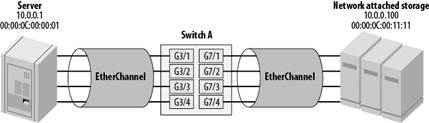

# 链路聚合
链路聚合是在两个设备间使用多个物理链路创建一个逻辑链路的功能。这种方式允许物理链路间共享负载。

交换机网络中使用的一种链路聚合的方法是EtherChannel。
EtherChannel可以通过思科的端口聚合协议（Port Aggregation Protocol, PAgP）或链路聚合协议（Link Aggregation Protocol, LACP）来配置或协商。

## EtherChannel
EtherChannel本来是由思科开发，将若干Fast Ethernet或Gigabit Ethernet捆绑成一个逻辑通道的***交换机到交换机***的LAN连接技术。

配置了EtherChannel之后的虚拟接口称为一个port channel。

物理接口捆绑在一起，成为一个port channel interface。

思科最早称之为EtherChannel Fast EtherChannel(FEC)，也称为Gigabit EtherChannel(GEC)，非思科公司常将链路聚合简写为LAG。

通过EtherChannel，一个逻辑链路的速度等于所有物理链路的总和。例如，如果你用4个100 Mbps的以太网链路创建1个EtherChannel，则EtherChannel的速度是400 Mbps。但是也会有一些问题，并不是在所有情况下增加的容量都确实等于物理链路的速度之和。例如，四个1 Gbps链路组成的EtherChannel，默认每一个会话的速度还是限制在1 Gbps。

默认情况下EtherChannel按照报文的目的MAC地址，给它指定一个物理链接。这也意味着EtherChannel上一个工作站与另一个服务器通信，只会使用到一条物理链路。实际上，EtherChannel上所有目的地为该服务器的数据流都只会走这一条物理链路。

也就是说，一个用户同一时刻只会得到1 Gbps。这种模式也可以更改为每一个报文在不同的物理链路上发送，当有多个不同的目的地址时，每一条路径都可以得到利用。

EtherChannel创建的是一对一的关系，即一个EtherChannel连接两个设备。可在两台交换机之间，或在一个激活了EtherChannel的服务器和一台交换机之间创建一个EtherChannel连接。但是，同一个EtherChannel连接无法将数据流发送到两台交换机。

## EtherChannel负载均衡

如前所述，EtherChannel默认情况下并不真的为各链路速度之和，只是在特定的链路发送特定的报文，给人的感知速度为所有链路的速度总和。

EtherChannel 帧分发使用 Cisco 专有的hash算法。 该算法是确定性算法； 如果使用相同的地址和会话信息，则总是散列到通道中的同一端口。 此方法可避免无序传送数据包。这一算法中很重要的一点是，***并不保证物理链路之间完全地均衡***。
该算法将目的MAC地址值hash成0-7的范围。无论EtherChannel中有多少链路都是同样的值。每一条物理链路都指定这八个值中的一个或多个，取决于EtherChannel中共有几条链路。
下图显示了按照这种算法报文是怎样分布的，注意到***分布并不总是均衡***的。

有八条物理链路的EtherChannel，每条链路指定单一值。有六条链路的EtherChannel，两条链路指定两个值，剩下四条链路指定四个值。这意味着两条链路（理论上均衡分布）会收到比剩余四条链路多一倍的数据流。从这张图很明显的看出，要使流量在各链路间均衡的分布（理想情况下），应当设置1，2，4，或8条物理链路。无论决定链路的信息是什么，算法都会将链路值hash为0-7。

用户可根据需求对算法进行更改。默认行为是使用目的MAC地址，但是，按照软硬件版本的不同，还可以有如下选项：

* 源MAC地址
* 目的MAC地址
* 源和目的MAC地址
* 源IP地址
* 目的IP地址
* 源和目的IP地址
* 源端口
* 目的端口
* 源和目的端口

更改默认设置的原因由应用情况而定。下图显示了一种相对普遍的布局：

一组用户连接到交换机A，通过EtherChannel连接到交换机B。默认按照每一个报文的目的MAC地址做负载均衡。但是，比较常见的情况是一台服务器的流量显著高于其他服务器。

让我们假设该网络中email服务器接收到多于1 Gbps流量，而其他服务器大约为50Mbps。使用基于目的MAC地址的方法会导致在EtherChannel丢包，因为目的地为email 服务器 MAC地址的报文会走同一条物理链路。一条链路发生过载时报文不会分散到其他链路，只会丢弃。在这种一台服务器接收流量超大的情况下，目的MAC地址负载均衡就不合理了。而根据源MAC地址负载均衡更为合适。

另一点需要记住的是，***负载均衡算法只适用于EtherChannel上发送的报文***。它并没有***双向功能***。在交换机A上使用基于源MAC地址的算法可能比较合适，但对于交换机B不一定合适，因为email服务器是使用最多的服务器。当报文从email服务器返回，源MAC地址就是它自己本身。因此，如果我们在交换机B上使用基于源MAC地址的负载均衡算法，就会碰到一开始同样的问题。

这种情况下，解决方法是***在交换机A使用基于源MAC地址的负载均衡算法***，而在***交换机B使用目的MAC地址的算法***。如果所有服务器在一台交换机而所有用户在另一台，这一解决方案是有效的。但现实中更常见的情况是所有这些设备都连接在一台交换机上，这时就没那么走运了。

下图显示了一个比较有趣的问题。

一台服务器通过EtherChannel连接到交换机A，一台NAS也通过EtherChannel连接到交换机A。服务器的所有文件系统都挂在到NAS设备上，服务器作为一台服务超过5000人的数据库服务器负载很大。服务器和NAS之间的带宽需求超过2Gbps。

***目前没有解决这一问题的简单的方法***。

不能使用源MAC地址或目的MAC地址做负载均衡，因为每种情况都只有一个地址。同样的理由，也不能用源和目的MAC地址结合，源和目的IP地址结合的方法。也不能基于源或目的端口号，因为一旦协商结束后，它们就不会改变。

一种可能的方法是，驱动支持的情况下，改变服务器和/或NAS设备，每一个link都有自己的MAC地址，但是报文还是会从其中一个地址发出另一个地址接收。

***唯一的解决方法***是手动负载均衡或采用更快的链接。将链路分为4个1Gbps，每一个有自己的IP网络，每个连接mount挂载不同的文件系统可以解决这一问题。有点太过复杂的话，直接使用更快的物理连接，如10 Gbps。