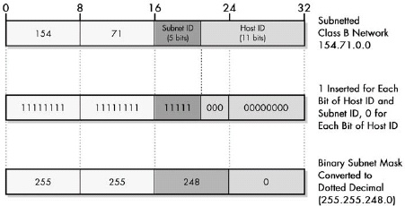

# IP地址与子网
起初，IP地址只有两层结构：网络与主机。

子网地址向其中添加了一层新的结构：不同于仅有主机，网络有分为子网与主机。
每一个子网的功能近乎于完整的网络。

子网的添加构成了三层网络结构：包含子网的网络，各自由若干主机构成。

IP地址由此被分为三个部分：网络ID，子网ID与主机ID。
IP地址长度仍固定为32位，其中，A类网络8位子网掩码，B类网络16位子网掩码，C类网络24位子网掩码。

## 子网划分
对于每一类网络，网络数以及每一网络中包含的主机数，决定了它们各自占用多少比特位。这一准则同样适用于如何划分子网与主机。
子网数量为2的子网ID次方，每一子网内的主机数为2的主机ID次方。
假设一个B类网络154.71.0.0，网络ID占16位（154.71），主机ID占16位。没有子网的情况下一共可容纳65，534台主机。
按照实际需求将16位划分为子网与主机：1位子网15位主机，或2与14，3与13。。。

如下图所示，划分为5位子网与11位主机，子网数越多，主机数越少。

搭建IP子网时，如何划分子网与主机数是最重要的问题之一。子网所占位取决于整个网络中的物理子网数，每一子网中的主机数不能超过子网划分所允许的最大数量。

## IP子网掩码
在没有子网的网络环境下，路由器通过IP地址的前八位来决定是哪一类型的网络，从而它们知道哪些是网络ID哪些是主机ID。

划分子网时，路由器也需要知道主机ID是如何划分成子网ID与主机ID的，但是划分方法可以是任意组合，也***没有办法从IP地址看出来***。因此，必须有额外的信息告知解析IP地址的设备，这一信息称为***子网掩码***，以32比特数的形式呈现。

掩码位的1和0结合布尔函数与和或的功能对于地址中的比特位进行选择或清除。
子网掩码中的32位对应于IP地址相同位置上的数字。
掩码位为1时，则地址中该位作为网络ID或子网ID，而掩码位为0时，则地址中该位表示主机ID。

* 子网掩码为1：将IP地址中的0或1与1进行与操作，即：当子网掩码位为1，IP地址保持不变。
* 子网掩码为0：任何数和0做与操作都是0，即：当子网掩码位为0，IP地址清零。

因此，将子网掩码应用于IP地址，***网络ID和子网ID保持不变，移除主机ID***。
执行此功能的路由器由此获得子网地址，因为它知道网络类型，因此能够区分网络位与子网地址位。

举例来说，假设将B类网络154.71.0.0划分5位为子网ID，11位为主机ID。
因此，子网掩码有16个1代表网络部分（B类网络），接下来5个1作为子网部分，11个0用作主机ID。
二进制数表示为11111111 11111111 11111000 00000000，十进制数表示为255.255.248.0。

举例：
假设有一台主机IP地址154.71.150.42，路由器需要找出该主机位于哪一子网，则它的掩码操作如下图所示：

结果，154.71.150.42所属的子网为154.71.144.0。另一台路由器能够从中区分出网络ID与子网ID，因为地址的前两个比特位是10，是一个B类网络。所以网络ID占16位，子网ID一定是17至21。这里，子网是10010，或子网18。

提一个问题：既然子网掩码只是将网络地址划分出网络部分与子网部分，那为什么还要使用另外的32位比特数255.255.248.0，而不直接将IP地址第21位指定为分界线呢？这是有历史原因的：因为需要考虑不连续的掩码情况。同时，它也能够让路由器进行快速的掩码操作来找出子网地址。

除了将16位划分为5位子网ID与11位主机ID，标准也允许前2位用作子网ID，4位用作主机ID，之后3位用作子网ID，7位用作主机ID。因此子网掩码为11000011 10000000。当然，这会造成混淆，是不推荐的，实际中也没有人会这么做。

鉴于非连续掩码实际不会应用，以及现今的计算机速度大幅提升，新的表达法为154.71.150.42/21。

## IP子网掩码设定
假设B类网络154.71.0.0，没有子网的话一共有65,534台主机。划分子网时，按照以下方法：

1. 1位用作子网ID，15位用作主机ID：那么子网数为2^1，第一个子网是0，第二个子网是1。每一个子网的主机数是2^15-2，或32，766。
1. 2位用作子网ID，14位用作主机ID：那么子网数为2^2，四个子网0，1，2，3。每一个子网的主机数是2^14-2，或16，382。

子网与主机ID位的划分取决于子网数与子网中最大主机数。
假设一个B类网络中有10个子网，需要4位表示子网（2^4=16，2^3=8），12位用作主机ID，每一子网最多4，094台主机。

如果你有20个子网，每一子网3，000台主机，那么就会碰到问题。需要5位表示20个子网，而3，000台主机需要12位。这时需要重新组织物理网络，如果无法做到，就需要第二个B类网络。

自定义子网掩码的方法是：从指定网络类型的默认子网掩码中，从最左边的0位开始，按照需要的子网数将0改为1。假设C类网络200.13.94.0，最后8位可供划分子网与主机，则有6种不同的划分方法。假如使用3位作为子网ID，5位作为主机ID，那么：

* 默认C类网络子网掩码：11111111 11111111 11111111 00000000
* 将最左边的3位0改为1：11111111 11111111 11111111 11100000
即子网掩码为：255.255.255.224。

通常情况下，所有子网大小必须相同。因此，最大一个子网的主机数决定了需要多少位比特用作主机ID。因此前例中，前19个子网每个子网最多100台主机，而第20个子网需要3000个主机，就会碰到问题。这种情况下，需要将最后一个过大的子网拆成若干个小的子网。

