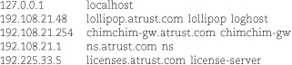
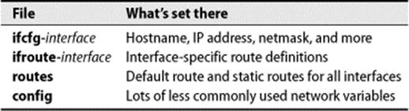
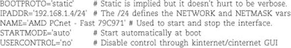
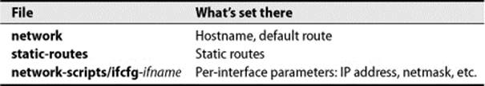
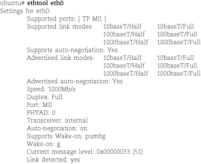
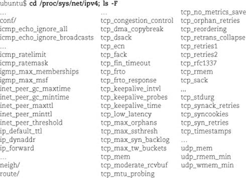

# Linux网络配置
将一台设备添加到本地网络的基本步骤包括：

* 指定唯一的IP地址与主机名。
* 确保启动时正确配置网络接口。
* 创建默认路由。
* 指定DNS域名服务器以使设备能够连接到网络其他部分。

## 配置

###  指定主机名与IP地址
使用/etc/hosts文件是将设备名映射到IP地址的最简单的方式，每一行以IP地址开始，跟随识别到的各种符号名：

由于/etc/hosts仅包括本地映射而且必须维护在每一台客户端设备，所以最好保存那些需要在启动时映射的信息（即：主机本身，默认网关，以及域名服务器）。

可使用**hostname命令**为设备指定主机名。该命令通常在启动脚本中运行，脚本中包含从配置文件读取的主机名。

### ifconfig：配置网络接口
ifconfig打开或关闭网络接口，设置IP地址与子网掩码，以及其他选项和参数。

通常在启动时通过命令行从配置文件中读取参数来运行，但也可以手动运行以做修改。

ifconfig命令格式如下：

	ifconfig interface [family] address options…

例如：

	ifconfig eth0 192.168.1.13 netmask 255.255.255.0 up

为eth0设置IPv4地址与子网掩码，并将该接口准备好供使用。

大多数系统中，**ifconfig –a**列出系统的网络接口以及当前设置。

**family**参数告诉ifconfig配置的是哪一种网络协议。用户可以对一个接口设置多个协议并同时使用，但必须分开配置。**IPv4选项为inet，IPv6选项为inet6**。缺省为inet。

**address**参数指定接口的IP地址。也可以使用主机名，但该主机名必须能在启动时解析为IP地址。对于设备的主接口来说，这意味着主机名必须出现在本地hosts文件中，因为其他解析方式依赖于已被初始化的网络。

关键字**up**将接口打开，**down**将其关闭。

**netmask**选项为接口设置子网掩码。

**broadcast**选项为接口指定IP广播地址。

### route配置静态路由
route命令指定静态路由，指明**该路由表项永远不会更改**，即使运行路由进程。当在本地网络中添加新的设备时，通常仅需要指定默认路由。
这里有两种情况：

1. 当报文目的地址是直连网络上的某台主机时，路由表中的 “next-hop gateway”是本地主机自己的一个接口，报文直接发送到目的地，这时可在配置接口时用ifconfig命令将路由添加到路由表中。 
2. 可能没有与目的地址相匹配的路由，这时，启用默认路由，否则，返回ICMP“network unreachable” 或 “host unreachable” 信息给发送方。很多本地网络只有一个出口，所以只需配置指向出口的默认路由。

每一条route命令添加或删除一条路由。

如下route命令原型几乎适用于每一Linux版本：

	route add -net 192.168.45.128/25 zulu-gw.atrust.net

该命令通过网关路由器zulu-gw.atrust.net添加一条到192.168.45.128/25网络的路由。

通常，网关路由器是相邻主机或本地主机的一个接口（Linux要求在网关地址前加上gw选项名）。

route命令必须能够将zulu-gw.atrust.net解析成IP地址。

## Ubuntu网络配置
如下图所示，Ubuntu在/etc/hostname以及/etc/network/interfaces，以及/etc/network/options中配置网络信息。

IP地址，网络掩码，默认网关在 /etc/network/interfaces中设置。以iface关键字开头的一行介绍了各个接口。iface之后的缩进行指明附加参数。例如：

ifup和ifdown命令会读取该文件并通过调用下层命令（诸如ifconfig）并配以合适的参数将接口连通或断开。

auto语句指定启动时默认或ifup –a运行时的连通接口。

iface行中的inet关键字是ifconfig中使用的地址。

关键字static表示一种“方式”，指eth0的IP地址和网络掩码是直接指定的。地址和网络掩码行要求静态配置，gateway行指明默认网关，用于安装默认路由。

## SUSE网络配置

SUSE用户可以选择NetworkManager或是传统的配置方法，用户可以在YaST中做出选择。也可以使用YaST GUI来配置传统系统。

这里，我们介绍传统方式。除了配置网络接口以外，YaST也提供 /etc/hosts文件，静态路由，DNS配置的直接UI。下图显示了底层的配置文件。

除了DNS参数以及系统主机名之外，SUSE将大多数网络选项配置在 **/etc/sysconfig/network**目录下的**ifcfg-interface**文件。

**每一个接口呈现一个文件**。

除了指定接口的IP地址，网关，以及广播信息，ifcfg-*文件可以配置很多其他网络选项。**ifcfg.template**文件对很多参数有清楚的注释。以下图为例：

**SUSE系统中全局静态路由信息（包括默认路由）存储在routes文件中**。

文件中的各行就好象route命令省略了选项名，内容包含**目标地址**，**网关**，**掩码**，**接口**以及**可选参数**存储在路由表中，供路由进程查询。对于上述仅有默认路由的主机来说，路由文件包含以下内容：
default 192.168.1.254 - -

针对不同接口的路由保存在ifroute-interface文件中，接口部件的命名方法与ifcfg-*文件一致。其内容格式与routes文件相同。

## RedHat网络配置
Red Hat网络配置GUI名为system-config-network，也可以通过Network名下面的System->Administration菜单下访问。该工具为配置网络接口与静态路由提供了一个简单的UI，也提供建立IPsec通道，配置DNS，添加/etc/hosts的面板。

下表列出了GUI编辑的底层文件。可在/etc/sysconfig/network中设置机器的主机名，也包括DNS域名以及默认网关。

例如，以下是某个以太网接口的network文件：

	NETWORKING=yes
	NETWORKING_IPV6=no
	HOSTNAME-redhat.toadranch.com
	DOMAINNAME=toadranch.com ### optional
	GATEWAY=192.168.1.254

接口相关的数据存储在 /etc/sysconfig/network-scripts/ifcfg-ifname，ifname是网络接口的名字，该文件为每个接口设置IP地址，掩码，网络，以及广播地址。也包含指明接口是否要在启动时开启。
常规机器有配置以太网接口以及回环接口的文件，例如:

	DEVICE=eth0
	IPADDR=192.168.1.13
	NETMASK=255.255.255.0
	NETWORK=192.168.1.0
	BROADCAST=192.168.1.255
	ONBOOT=yes

以及

	DEVICE=lo
	IPADDR=127.0.0.1
	NETMASK=255.0.0.0
	NETWORK=127.0.0.0
	BROADCAST=127.255.255.255
	ONBOOT=yes
	NAME=loopback

基于DHCP的echo文件更加简单:

	DEVICE=eth0
	BOOTPROTO=dhcp
	ONBOOT=yes

在/etc/sysconfig文件中更改配置信息之后，对相应端口运行 ifdown ifname， ifup ifname。

如果一次配置多个端口，使用命令service network restart重置整个网络。这其实是运行/etc/rc.d/init.d/network的一个快速的方法，每次启动时被调用，加上start参数。

也可以通过启动脚本来配置静态路由，添加到/etc/sysconfig/static-routes文件的路由信息在启动时被存入路由表。这些表项为route add命令指定参数：

	eth0 net 130.255.204.48 netmask 255.255.255.248 gw 130.255.204.49
	eth1 net 192.38.8.0 netmask 255.255.255.224 gw 192.138.8.129

首先列出的是接口，但它实际上是在route命令行的最后执行，将路由与指定接口相关联。命令剩下的内容包含route参数。上文静态路由的例子会产生如下命令：

	route add -net 130.225.204.48 netmask 255.255.255.248 gw 130.225.204.49 eth0
	route add -net 192.38.8.0 netmask 255.255.255.225 gw 192.38.8.129 eth1
	
## Linux网络硬件选项
ethtool命令查询并设置网络接口关于媒体相关的参数。如：链路速度和双工。

它代替了以前的mii-tool命令，但有些系统中两者并存。

只要简单加上接口名就可以查询它的状态。例如，eth0接口（PC主板的网卡接口）启动了自协商并且运行于全速率：

将该接口锁定在100 Mb/s全双工，使用以下命令：

	ethtool -s eth0 speed 100 duplex full
	
如果想知道自协商在系统中是否可靠，也可以使用**ethtool –r**命令，可使链路参数立刻重新协商。

另一个有用的选项是**-k，显示哪些协议相关任务指定给网络接口，而不是由内核执行**。
大多数接口能够计算校验和（checksum），一些也可以辅助分段任务。可以通过ethtool –K命令结合多个子选项开启或禁用特定类型的offloading（-k显示当前值，-K对其进行设置）。

通过ethtool所做的变更是暂时的。如果希望永久性更改，需要确保ethtool作为系统网络配置的一部分来运行。最好是把它作为各个接口配置的一部分，如果你只是在启动时运行一些ethtool命令，那么在接口重启而系统未重启时配置就无法正确生效。

### 注

* **Red Hat系统中**，可以在/etc/sysconfig/network-scripts. ifup下的配置文件中添加一行ETHTOOL_OPTS=，以将整行作为参数传递给ethtool。
* **SUSE**中ethtool的用法与Red Hat相似，但是选项名为ETHTOOL_OPTIONS，配置文件保存在/etc/sysconfig/network。
* **Ubuntu系统**中，可以在 /etc/network/interfaces的接口配置脚本中运行ethtool命令。

## Linux TCP/IP选项
Linux将每个可调内核变量放在/proc虚拟文件系统中。网络变量位于/proc/sys/net/ipv4。以下是一些重要变量的列表：

许多名字中含有**rate和max**的变量用作**阻止服务器攻击**。子目录conf包含按照各接口设置的变量，包括all和default以及各接口子目录（包括loopback）。各子目录包含相同的一组文件。

假设用户在conf/eth0子目录中更改了一个变量，则变更仅适用于该接口。

如果在conf/all中更改了变量值，**你也许认为更改适用于所有接口，但实际上并非如此**。

每一个变量对于接收通过all所作的更改有各自的规则。有些是与当前值做或运算，有些是做与运算，还有些是取最大或最小值。

**除了内核代码以外没有文档详细说明这一过程，因此最好避免这样做，比较好的做法是对各接口分别做修改**。

如果用户在conf/default中修改了变量，新的值会传递到所有在这之后配置的接口。另一方面，最好保持默认值不变，以供取消更改时参考。

/proc/sys/net/ipv4/neigh目录同样包含了各接口子目录。子目录中的文件掌控相应接口的ARP table管理以及IPv6邻居发现。以下是变量列表，以gc（代表垃圾回收）开头的变量决定ARP table表项超时以及丢弃。

要查看变量值，使用cat命令，要进行设置，使用echo重定向到合适的文件名。例如：

	ubuntu$ cat icmp_echo_ignore_broadcasts0
	
显示当变量值为0时，则广播ping不能被忽略。要将它设置为1，在 /proc/sys/net 中，运行

	ubuntu$ sudo sh -c "echo 1 &gt; icmp_echo_ignore_broadcasts"

通常，你登录的网络与调整的网络是同一个，所以要小心行事。

在更改生产设备配置前务必在台式机上测试。
要永久更改某参数（更准确的说，系统每次启动时都重置该值），在/etc/sysctl.conf中添加合适的变量，这些变量在启动时由sysctl命令读取。

文件sysctl.conf的格式是变量名__=值，而不是手动在shell中修改的格式echo value > variable。变量名是相对于/proc/sys的路径，可以用点或斜杠。

例如：/etc/sysctl.conf 文件中，

	net.ipv4.ip_forward=0
	net/ipv4/ip_forward=0
都会将主机IP转发关闭。

同时，内核源版本中的 ip-sysctl.txt文件也有一些比较好的注释信息。
