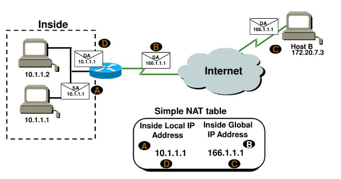

# NAT原理与配置

NAT技术让少数公有IP地址被使用私有地址的大量主机所共享。这一机制允许远多于IP地址空间所支持的主机共享网络。同时，由于NAT屏蔽了内部网络，也为局域网内的机器提供了安全保障。

NAT的基本实施过程包括使用一个预留给本地IP网络的私有地址成立组织的内部网络，同时分配给组织一个或多个公网IP地址，并在本地网络与公网之间安装一个或多个具有NAT功能的路由器。

NAT路由器实现的功能包括将数据报中私网地址转换成公网地址，反向亦然。当有报文通过时，网络地址转换其不仅检查报文信息，还将报文头中的IP地址和端口信息进行修改，以使处于NAT之后的机器共享少数公网IP地址。

## 何时使用NAT
因为NAT能够减少在网络环境中所需的公共IP地址需求，因此当两家公司重复内部地址合并时，这一技术是很有帮助的。当组织改变其Internet服务供应商（ISP），但网络管理员不想改变内部地址方案时，NAT也是一个很好用的工具。

以下是应用NAT的场景：

* 用户需要访问Internet但主机没有全球唯一的IP地址
* 用户更改ISP需要对网络重新编号
* 用户需要合并地址重复的内网

通常NAT应用于边界路由器。例如，下图中NAT应用于企业连接到Internet的路由器上：

## NAT的优势与不足
| 优势 | 不足 |
|------|------|
| 节约合法注册地址 | 转换导致交换路径延时 |
| 解决地址重叠问题 | 导致端到端IP地址无法追溯 |
| 提高访问internet灵活性 | 某些应用程序无法使用 |
| 网络变动无需地址重新编号 |  |

## 网络地址转换类型

* 静态NAT：此类NAT在本地和全局地址之间做一到一的永久映射。须注意静态NAT要求用户对每一台主机都有一个真实的Internet IP地址。
* 动态NAT：允许用户将一个未登记的IP地址映射到一个登记的IP地址池中的一个。采用动态分配的方法将外部合法地址映射到内部网络，无需像静态NAT那样，通过对路由器进行静态配置来将内部地址映射到外部地址，但是必须有足够的真正的IP地址来进行收发包。
* 端口NAT（PAT）：最为流行的NAT配置类型。通过多个源端口，将多个未登记的IP地址映射到一个合法IP地址（多到一）。使用PAT能够使上千个用户仅使用一个全局IP地址连接到Internet。

## NAT术语

NAT术语还是比较直观的。NAT地址转换之后成为**全局地址**。通常是Internet上使用的公网地址。如果不访问Internet的话就不需要用到。

* 内部本地地址：实际上是尝试访问Internet的发送主机的私有地址。
* 外部本地地址：通常是连接到用户ISP的路由器接口，也是报文开始传输的公有地址，真实的Internet地址
* 内部全局地址：转换之后，内部本地地址之后被称为内部全局地址，真实的Internet地址
* 外部全局地址：成为目标主机的地址，真实的Internet地址

## NAT实现细节

下图中，主机10.1.1.1将报文发送到有NAT功能的边界路由器。路由器将源IP地址识别为内部本地IP地址，在报文中转换源IP地址，并在NAT表中记录此次转换。
配有新转换源地址的报文发送到外部接口。外部主机将报文发送给目的主机并且NAT路由器通过NAT表将内部全局IP地址转换回内部本地IP地址。

**PAT方式中，所有内部主机都转换为一个IP地址**。如下图所示，除了内部本地IP地址和内部全局IP地址以外，还多了一个端口号。**端口号帮助路由器识别哪一台主机应当收到返回数据**。路由器使用来自各主机的源端口好来区别他们各自发出的数据。注意当报文离开路由器时有一个目标端口号80，而HTTP服务器将报文发回时目的端口号为1026。从而允许NAT转换路由器区别NAT表中的主机然后将目的IP地址转换回内部本地地址。

本例中，端口号在传输层用户识别本地主机。如果必须要使用真实全局IP地址来识别源主机，那就只能通过静态NAT，并且会用光所有地址。PAT允许我们在传输层识别主机，从而理论上一个真实IP地址可被65，000台主机共享。

##静态NAT配置

	ip nat inside source static 10.1.1.1 170.46.2.2
	!
	interface Ethernet0
	ip address 10.1.1.10 255.255.255.0
	ip nat inside
	!
	interface Serial0
	ip address 170.46.2.1 255.255.255.0
	ip nat outside
	!

在第一个路由器输出中， ip nat inside source 命令指定需要转换的IP地址。本例中，此命令配置了内部本地IP地址10.1.1.1到外部全局IP地址170.46.2.2的静态配置。

在各接口下都有一条ip nat命令。ip nat inside命令将该接口识别为内部接口，ip nat outside命令将该接口识别为外部接口。回头看 ip nat inside source 命令，该命令将内部接口作为转换的源或起点。也可以这样使用：ip nat outside source。该选项表明指定的外部接口会成为转换的源或起点。

## 动态NAT配置
动态NAT表示将一个地址池当作真实IP地址提供给内部一组用户。由于不使用端口号，对于同时尝试访问外部网络的用户必须提供真实的IP地址。

以下是动态NAT配置的示例输出：

	ip nat pool todd 170.168.2.3 170.168.2.254
	    netmask 255.255.255.0
	ip nat inside source list 1 pool todd
	!
	interface Ethernet0
	ip address 10.1.1.10 255.255.255.0
	ip nat inside
	!
	interface Serial0
	ip address 170.168.2.1 255.255.255.0
	ip nat outside
	!
	access-list 1 permit 10.1.1.0 0.0.0.255
	!
ip nat inside source list 1 pool todd 命令告知路由器将匹配access-list 1的IP地址转换到名为todd的IP NAT池中的一个地址。这里ACL并不是出于安全因素通过允许或拒绝数据来过滤报文。本例中，它是用来选择或指定我们感兴趣的数据流。当数据流与接入列表相匹配，就被拉入NAT进程转换。

命令 ip nat pool todd 170.168.2.3 192.168.2.254 netmask 255.255.255.0用来创建地址池，之后被分配给请求全局地址的主机。做Cisco NAT故障排查时，一定要检查池中确保有足够地址提供转换给内部主机。最后，确保池名匹配，注意区分大小写。

## 端口NAT配置
以下是端口NAT配置的示例输出：

	ip nat pool globalnet 170.168.2.1 170.168.2.1 netmask 255.255.255.0
	ip nat inside source list 1 pool globalnet overload
	!
	interface Ethernet0/0
	ip address 10.1.1.10 255.255.255.0
	ip nat inside
	!
	interface Serial0/0
	ip address 170.168.2.1 255.255.255.0
	ip nat outside
	!
	access-list 1 permit 10.1.1.0 0.0.0.255

端口NAT与动态NAT配置的不同之处在于：
地址池变为只有一个IP地址

在ip nat inside source命令最后加入overload关键字。

本例中一个关键元素是使用了池中的一个IP地址作为外部接口IP地址。如果有其他可用地址如170.168.2.2可作为额外地址，这样做在内部大量用户同时为活跃状态，需要不止一个重载IP地址时很有帮助。

