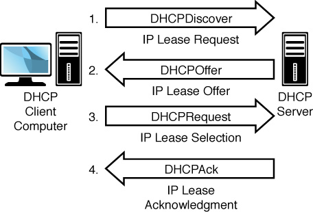

# DHCP
动态主机设置协议（Dynamic Host Configuration Protocol, DHCP）是一个局域网的网络协议，使用UDP协议工作，主要有两个用途：

* 给内部网络或网络服务供应商自动分配IP地址给用户
* 给内部网络管理员作为对所有电脑作中央管理的手段

DHCP从一个IP地址池中提供IP地址，该池有DHCP服务器数据库定义，称为scope。如果客户端接受这一地址，则它可在一个预定义的期限内使用该地址，称为租约。如果客户端无法从DHCP服务器获取IP地址，它就无法正常初始化TCP/IP。

在DHCP为客户端配置TCP/IP参数时，DHCP服务器和客户端都需要经历四步过程。注意到很多通讯是通过广播的方式来完成的。如果路由器无法转发这些DHCP消息时，广播通信可能会造成问题。

当客户端处于以下四种状态之一时，必须使用IP租约进程：

1. 配置使用DHCP的客户端第一次初始化TCP/IP；
2. 客户端请求特定的IP地址但服务器拒绝了该地址，在DHCP丢弃租约时即会发生。
3. 客户端之前租约了一个IP地址，但之后释放了该IP地址，现申请一个新的租约。这种情况发生于用户输入
4. ipconfig /release和ipconfig /renew命令时。

## 客户机请求IP地址（DHCPDISCOVER）
当一个IPv4客户机启动时监测到需要IP地址，它会初始化一个TCP/IP的限制版本，之后广播一个报文请求寻找DHCP服务器的地址。该广播报文告知监听服务器客户端需要IP地址信息。DHCP客户端发送的报文这一阶段包括租约请求，客户端源地址，0.0.0.0，目的地址，即广播地址255.255.255.255。报文也包括客户端硬件MAC地址和机器名，该信息也指明了向DHCP服务器发起请求的设备。

客户端向DHCP服务器发送请求IP地址的真实报文称为DHCPDISCOVER报文。网络上每一台安装了TCP/IP协议的主机都会接收到这种广播信息，但只有DHCP服务器才会做出响应。

## 服务器提供IP地址（DHCPOFFER）
所有拥有有效IP地址的DHCP服务器都会向DHCP客户端提供IP地址信息。它响应以地址池中一个未分配的IP地址供请求主机使用。要能够响应DHCPDISCOVER报文，DHCP服务器必须拥有客户端的有效IP配置信息。DHCP服务器回复的DHCPOFFER报文包含以下信息：

* 客户端的硬件地址
* 提供的IP地址
* 合适的子网掩码
* 租约有效期
* 服务器ID，即DHCP服务器的IP地址

## 客户机选择IP地址（DHCPREQUEST）
DHCP客户端选择它所接收到的第一个DHCPOFFER报文提供的IP地址。之后，它把这一信息广播至网络。该报文中，客户端请求服务器提供给它的IP地址。这是因为客户端可能收到不止一个DHCP服务器发送的offer。通过广播这一请求，客户端告知其他DHCP服务器不会再接受其他offer。为了进一步确保客户端接受的服务器offer没有疑义，DHCPREQUEST报文中还包含以下信息：

* 提供所接受offer的服务器IP地址
* 客户端硬件地址
* 客户端接受的IP地址

## 服务器确认IP租约（DHCPACK）
DHCP服务器对客户端作出响应，将IP地址分配给客户端。之后，它发送DHCPACK确认信息给客户端。该信息包含IP地址的有效租约以及其他配置信息。
有时，在客户端接收服务器提供的租约后，DHCP租约请求仍可能不成功。可能有以下几种情况：

* 由于客户端移动至其他子网，IP地址无效
* 客户端尝试租约它之前的IP地址但该IP地址不再可用
在上述情况下，服务器会发送一条不成功信息DHCPNACK。收到DHCPNACK的客户端必须重新开始整个DHCP初始化进程。也就是说，它必须发送另一个DHCPDISCOVER报文查找新的IP地址。