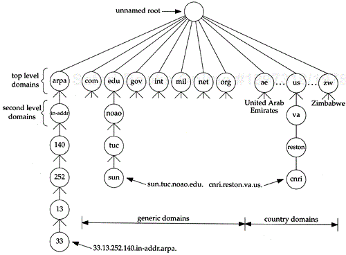

# DNS
因特网上作为域名和IP地址相互映射的一个分布式数据库，能够使用户更方便的访问互联网，而不用去记住能够被机器直接读取的IP数串。通过主机名，最终得到该主机名对应的IP地址的过程叫做域名解析（或主机名解析）。

## DNS基础
DNS命名空间是一个分层结构，类似于Unix文件系统。如下图的分层空间所示。

每个节点都有一个标签，最多可以有63个字符。树结构的根部是一个特殊的标签为null的节点。树结构中节点的域名就是一串标签列表，从该节点开始，一直到根节点，通过dot来将标签分开。（这是与Unix文件系统不同的地方，将路径名放在最前沿着树结构下来）。树结构中的每一个节点必须有一个唯一的域名，但是树结构中不同的point可以有相同的标签。

**域名分为绝对域名与相对域名**。绝对域名也称为完全合格的域名FQDN(Full Qualified Domain Name)，它是以“.”结尾的域名，例如sun.tuc.noao.edu.。如果不以“.”结尾，则假设该域名需要被补充完整。域名如何补充则取决于使用的DNS软件。

顶级域名分为三个区域：

* arpa是用来做反向域名解析的特殊域。
* 七个3字母域名称为普通域名，也有称为组织域。
* 所有两个字母域名是基于ISO 3166国家代码，称为国家域名或地理域名。

上图中没有显示的很重要的一点是DNS中责任的分派。没有一个单一的实体来管理树中的每一个标签。相反，一个实体（网卡）维持树中的一部分（顶级域名）并将其他责任分配给zone中其他实体。

zone指DNS树中分开管理的子树。例如，二级域名就是一个常见的zone，noao.edu。很多二级域名又分为更小的zone。例如，一所大学按照系别，公司按照部门分为分为更小的zone。

熟悉Unix文件系统的会注意到DNS树按zone分区很像逻辑Unix文件系统分为物理磁盘分区。如同我们从上图中无法看出zone的委托授权管理位于何处，从Unix文件系统的类似图中也难以看出哪个目录在哪个磁盘分区上。

一旦zone的委托授权分派好，zone的负责人需要为其提供多个域名服务器。当zone中安装了新的机器，zone的DNS管理员为其分配域名与IP地址，并将信息输入域名服务器的数据库中。域名服务器委托授权管理一个或多个zone。zone管理人员必须为其提供一台主域名服务器以及一个或多个二级域名服务器。主服务器和二级服务器必须相互独立并冗余，以使zone不会受到单点故障的影响。主服务器和二级服务器的区别在于，主服务器从磁盘文件加载zone的所有信息，而二级服务器从主服务器获取所有信息。这一过程称为zone transfer。

当新的机器添加到zone中，管理员将合适的信息（至少需要名称和IP地址）添加到主服务器系统的磁盘文件中。之后告知主域名服务器重新读取自己的配置文件。二级服务器定期查询（通常3小时一次），如果主服务器有新的数据，二级服务器通过zone transfer来获取。

当域名服务器没有所需信息时怎么办呢？它必须联系另外一台域名服务器。这是DNS的分布式特性。并不是每一台服务器都知道如何联系其他域名服务器，但每一台服务器都知道如何联系根域名服务器。根服务器的IP地址存放于主服务器的配置文件中。主服务器必须知道根服务器的IP地址，而非DNS名。之后，主服务器获知所有二级域名服务器的名称和位置（即IP地址）。整个交互过程是：发起请求的域名服务器必须联系根服务器，根服务器告知请求服务器联系另外一台服务器，这样逐级进行。

DNS的一个基本属性是缓存。即，当一个域名服务器收到一条映射信息（如一个主机名的IP地址），它会将该信息放入缓存，以使之后的查询可以使用缓存后的结果，而无需额外发起对其他服务器的查询。