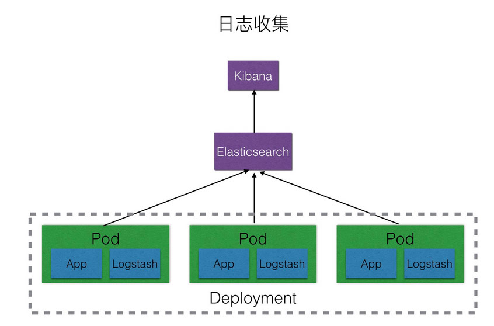

# Kubernetes使用ELM
Kubernetes集群中的日志收集解决方案如下：
| 编号 | 方案 | 优点 | 缺点 | 
| ----- | ----- | ------ | ----- |
| 1 | 每个app的镜像中都集成日志收集组件 | 部署方便，kubernetes的yaml文件无需特别配置，可以为每个app自定义日志收集配置 | 强耦合，不方便应用和日志收集组件的升级和维护且会导致镜像过大 |
| 2 | 单独创建一个日志收集组件跟app的容器一起运行在同一个pod中 | 低耦合，扩展性强，方便维护和升级 | 需要对kubernetes的yaml文件进行单独配置，略显繁琐 |
| 3 | 将所有的pod的日志都挂载到宿主机上，每台主机上单独起一个日志收集pod | 完全解耦，性能最高，管理起来最方便 | 需要统一日志收集规则，目录和输出方式 |

## sidecar方式架构图

