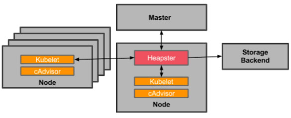

# Kubernetes监控
## cAdvisor
Kubernetes每个节点上都会运行一个监控agent——cAdvisor。
**cAdvisor**会收集本机节点上主机和容器的监控数据（cpu, memory, filesystem, network, uptime）。

目前，Kubernetes已经将cAdvisor集成到kubelet中。
每个node节点都可以通过web直接进行访问。
```note
cAdvisor web界面访问： http://< Node-IP >:4194
cAdvisor也提供Restful API: https://github.com/google/cadvisor/blob/master/docs/api.md
```
## InfluxDB
InfluxDB是一款用Go语言编写的开源分布式时序、事件和指标数据库，无需外部依赖。
该数据库现在主要用于存储涉及大量的时间戳数据，如DevOps监控数据，APP metrics, loT传感器数据和实时分析数据。

InfluxDB特征：
* 无结构(无模式)：可以是任意数量的列
* 可以设置metric的保存时间
* 支持与时间有关的相关函数(如min、max、sum、count、mean、median等)，方便统计
* 支持存储策略:可以用于数据的删改。(influxDB没有提供数据的删除与修改方法)
* 支持连续查询:是数据库中自动定时启动的一组语句，和存储策略搭配可以降低InfluxDB的系统占用量。
* 原生的HTTP支持，内置HTTP API
* 支持类似sql语法
* 支持设置数据在集群中的副本数
* 支持定期采样数据，写入另外的measurement，方便分粒度存储数据。
* 自带web管理界面，方便使用(登入方式：http://< InfluxDB-IP >:8083)

参考：https://www.kubernetes.org.cn/936.html
## Heapster
Heapster是一个收集者，将每个Node上的cAdvisor的数据进行汇总，然后导入到第三方存储（InfluxDB）。


Heapster首先从K8S Master获取集群中所有Node的信息，然后通过这些Node上的kubelet获取有用数据，而kubelet本身的数据则是从cAdvisor得到。
所有获取到的数据都被推到Heapster配置的后端存储中，并还支持数据的可视化。

基于Heapster的方案一般是：InfluxDB+grafana。

参考：https://www.kubernetes.org.cn/932.html

## Prometheus


基于Prometheus的方案一般是：Prometheus+Alertmanager+grafana。

参考：https://www.kubernetes.org.cn/3418.html