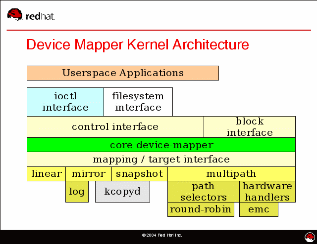

# Device Mapper
## 简介
Device Mapper是Linux2.6内核中支持**逻辑卷管理**的**通用设备映射机制**。
它为实现用于**存储资源管理**的**块设备驱动**提供了一个高度模块化的**内核架构**。



在内核中Device Mapper通过一个一个模块化的**target driver插件**实现**对IO请求的过滤或者重新定向**等工作。
当前已经实现的target driver插件包括软raid、软加密、逻辑卷条带、多路径、镜像、快照等。
图中linear、mirror、snapshot、multipath表示的就是这些target driver。

Device mapper进一步体现了在Linux内核设计中**策略和机制**分离的原则，将所有与策略相关的工作放到**用户空间**完成，内核中主要提供完成这些策略所需要的机制。

Device mapper用户空间相关部分主要负责配置具体的策略和控制逻辑，比如逻辑设备和哪些物理设备建立映射，怎么建立这些映射关系等等。
而具体过滤和重定向IO请求的工作由内核中相关代码完成。
因此整个device mapper机制由两部分组成：
1. 内核空间的device mapper驱动。
2. 用户空间的device mapper库以及它提供的dmsetup工具。

## 内核部分
Device mapper的内核相关代码已经作为Linux 2.6内核发布版的一部分集成到内核源码中了。
相关代码在内核源码的driver/md/目录中，其代码文件可以划分为实现device mapper内核中基本架构的文件和实现具体映射工作的target driver插件文件两部分。

### 重要概念
Device mapper在内核中是作为一个**块设备驱动**被注册的。它包含三个重要的对象概念：

* **mapped device**
* **映射表**
* **target device**。

Mapped device是一个**逻辑抽象概念**，可以理解为**内核向外提供的逻辑设备**。
它通过**映射表**描述的映射关系和target device建立映射。
从Mapped device到一个target device的映射表由一个多元组表示，该多元组包括：
* 表示mapped device逻辑设备的起始地址、范围
* 表示target device所在物理设备的地址偏移量以及target类型等变量组成（这些地址和偏移量都是以**磁盘的扇区**为单位的，即512个字节大小）。

Target device表示的是mapped device所映射的物理空间段，对mapped device所表示的逻辑设备来说，就是该逻辑设备映射到的一个物理设备。

Device mapper中这三个对象和target driver插件一起构成了一个**可迭代的设备树**。
在该树型结构中的顶层根节点是最终作为逻辑设备向外提供的mapped device，叶子节点是target device所表示的底层物理设备。

最小的设备树由单个mapped device和target device组成。

* **每个target device都是被mapped device独占的，只能被一个mapped device使用**。
* **一个mapped device可以映射到一个或者多个target device上**。
* **一个mapped device又可以作为它上层mapped device的target device被使用**，该层次在理论上可以在device mapper架构下无限迭代下去。


在上图中可以看到mapped device 1通过映射表和a、b、c三个target device建立了映射关系。
而target device a又是通过mapped device 2演化过来，mapped device 2通过映射表和target device d建立映射关系。

进一步看一下上述三个对象在代码中的具体实现。
1. dm.c文件定义的mapped_device结构用于表示mapped device，它主要包括该**mapped device相关的锁**，**注册的请求队列**和一些**内存池**以及**指向它所对应映射表的指针**等域。
2. Mapped device对应的映射表是由dm_table.c文件中定义的dm_table结构表示的，该结构中包含一个dm_target结构数组，dm_target结构具体描述了mapped_device到它某个target device的映射关系。
3. 而在dm_table结构中将这些dm_target按照B树的方式组织起来方便IO请求映射时的查找操作。

Dm_target结构具体记录该结构对应target device所映射的mapped device逻辑区域的开始地址和范围，同时还包含指向具体target device相关操作的target_type结构的指针。

Target_type结构主要包含了target device对应的target driver插件的名字、定义的构建和删除该类型target device的方法、该类target device对应的IO请求重映射和结束IO的方法等。

而表示具体的target device的域是dm_target中的private域，该指针指向mapped device所映射的具体target device对应的结构。

表示target device的具体结构由于不同的target类型而不同，比如最简单的线性映射target类型对应target device的结构是dm-linear.c文件中定义的linear_c结构。其定义如下：

``` c
struct linear_c {
    struct dm_dev *dev;
    sector_t start;
};
```
该target device的定义相当简单，就只包括了表示对应物理设备的dm_dev结构指针和在该物理设备中以扇区为单位的偏移地址start。
上述几个数据结构关系如图所示：


### 内核中建立过程

下面结合具体的代码简要介绍下在内核中创建一个mapped device的过程：
1. 根据内核向用户空间提供的ioctl接口传来的参数，用dm-ioctl.c文件中的dev_create函数创建相应的mapped device结构。这个过程很简单，主要是向内核申请必要的内存资源，包括mapped device和为进行IO操作预申请的内存池，通过内核提供的blk_queue_make_request函数注册该mapped device对应的请求队列dm_request。**并将该mapped device作为磁盘块设备注册到内核中**。
2. 调用dm_hash_insert将创建好的mapped device插入到device mapper中的一个全局hash表中，该表中保存了内核中当前创建的所有mapped device。
3. 用户空间命令通过ioctl调用table_load函数，该函数根据用户空间传来的参数构建指定mapped device的映射表和所映射的target device。该函数先构建相应的dm_table、dm_target结构，再调用dm-table.c中的dm_table_add_target函数根据用户传入的参数初始化这些结构，并且根据参数所指定的target类型，调用相应的target类型的构建函数ctr在内存中构建target device对应的结构，然后再根据所建立的dm_target结构更新dm_table中维护的B树。上述过程完毕后，再将建立好的dm_table添加到mapped device的全局hash表对应的hash_cell结构中。
4. 最后通过ioctl调用do_resume函数建立mapped device和映射表之间的绑定关系，事实上该过程就是通过dm_swap_table函数将当前dm_table结构指针值赋予mapped_device相应的map域中，然后再修改mapped_device表示当前状态的域。

通过上述的4个主要步骤，device mapper在内核中就建立一个可以提供给用户使用的mapped device逻辑块设备。

### IO流
Device mapper本质功能就是**根据映射关系和target driver描述的IO处理规则**，**将IO请求从逻辑设备mapped device转发到相应的target device上**。

Device mapper处理所有从内核中块一级IO子系统的generic_make_request和submit_bio接口中定向到mapped device的所有块读写IO请求。

IO请求在device mapper的设备树中通过请求转发从上到下地进行处理。
当一个bio请求在设备树中的mapped deivce向下层转发时，一个或者多个bio的克隆被创建并发送给下层target device。
然后相同的过程在设备树的每一个层次上重复，只要设备树足够大理论上这种转发过程可以无限进行下去。
在设备树上某个层次中，target driver结束某个bio请求后，将表示结束该bio请求的事件上报给它上层的mapped device。
该过程在各个层次上进行直到该事件最终上传到根mapped device的为止。
然后device mapper结束根mapped device上原始bio请求，结束整个IO请求过程。

Bio在device mapper的设备树进行逐层的转发时，最终转发到一个或多个叶子target节点终止。
因为**一个bio请求不可以跨多个target device(亦即物理空间段)**， 因此在每一个层次上，device mapper根据用户预先告知的mapped device的target映射信息克隆一个或者多个bio，将bio进行拆分后转发到对应的target device上。
这些克隆的bio先交给mapped device上对应的target driver上进行处理，根据target driver中定义的IO处理规则进行IO请求的过滤等处理，然后再提交给target device完成。

上述过程在dm.c文件中的dm_request函数中完成。Target driver可以对这些bio做如下处理：
1. 将这些bio在本驱动内部排队等待以后进行处理。
2. 将bio重新定向到一个或多个target device上或者每个target device上的不同扇区。
3. 向device mapper返回error状态。
IO请求就按照上文中描述的过程在图2中所示的设备树中逐层进行处理，直到IO请求结束。

### 小结
Device mapper在内核中向外提供了一个**从逻辑设备到物理设备的映射架构**，只要用户在用户空间制定好映射策略，按照自己的需要编写处理具体IO请求的target driver插件，就可以很方便的实现一个类似LVM的逻辑卷管理器。

Device mapper以ioctl的方式向外提供接口，用户通过用户空间的device mapper库，向device mapper的字符设备发送ioctl命令，完成向内的通信。

Device mapper还通过ioctl提供向往的事件通知机制，允许target driver将IO相关的某些事件传送到用户空间。

## 用户空间部分
Device mapper在用户空间相对简单，主要包括device mapper库和dmsetup工具。
Device mapper库就是对ioctl、用户空间创建删除device mapper逻辑设备所需必要操作的封装。
dmsetup是一个提供给用户直接可用的创建删除device mapper设备的命令行工具。

用户空间主要负责如下工作：
1. 发现每个mapped device相关的target device；
2. 根据配置信息创建映射表；
3. 将用户空间构建好的映射表传入内核，让内核构建该mapped device对应的dm_table结构；
4. 保存当前的映射信息，以便未来重新构建。

## Target Driver
Device mapper提供了一个统一的架构，通过target driver插件的方式允许用户根据实际的需要指定自己的IO处理规则，因此target driver充分体现了device mapper的灵活性。

Target driver主要定义对IO请求的处理规则，在device mapper中对target driver的操作已定义好了统一的接口，在实现中该接口由target_type结构中定义，它定义了以下target driver的方法：
* 构建target device的方法
* 删除target device的方法
* Target映射IO请求的方法
* Target结束IO请求的方法
* 暂停target device读写的方法
* 恢复target device读写的访问
* 获取当前target device状态的访问
* Target 处理用户消息的方法

用户可以根据具体需求选择性地实现上述方法，但**一般最少要实现前3种方法**，否则在device mapper下不能够正常的工作。

**linear target drive**就只实现了前3种方法和方法7，它完成逻辑地址空间到物理地址空间的线性映射，可以将多个物理设备以线性连接的方式组成一个逻辑设备，通过linear target driver将/dev/sda、/dev/sdb、/dev/sdc的三段连续空间组成了一个大的逻辑块设备。
Linear target的实现很简单，它的创建和删除方法主要完成申请和释放描述linear target device所用结构的内存资源；
IO映射处理方法的实现更是简单，如下代码所示：

``` c
static int linear_map(struct dm_target *ti, struct bio *bio,
              union map_info *map_context)
{
    struct linear_c *lc = (struct linear_c *) ti->private;
 
    bio->bi_bdev = lc->dev->bdev;
    bio->bi_sector = lc->start + (bio->bi_sector - ti->begin);
 
    return 1;
}
```

该映射方法就是将发送给逻辑设备mapped device的bio请求，根据映射关系以线性的方式重新定向到linear target device所表示物理设备的相应位置。如代码所示具体实现方法就是修改bio的bi_bdev设备指针为target device对应的设备指针，并根据target device的起始地址和该bio请求在mapped device设备上的偏移值改变IO请求开始的扇区号bi_sector，从而完成IO请求的重定向。

## 总结
Device Mapper是Linux操作系统中块设备一级提供的一种主要映射机制，现在已被多数Linux下的逻辑卷管理器所采用。
在该机制下，实现用户自定义的存储资源管理策略变得极其方便。
理解device mapper所提供的映射机制，也是进一步理解Linux下一些常见逻辑卷管理器实现的基础。