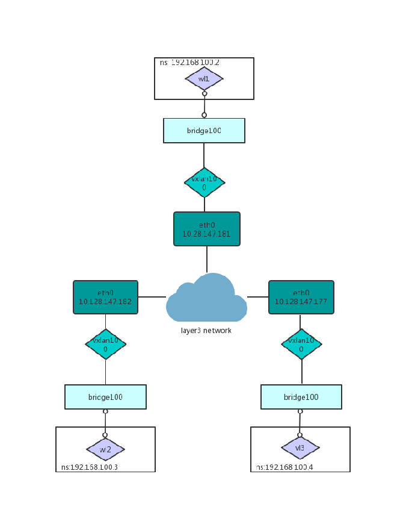

# VxLan
## 概述
Virutal eXtensible Local Area Network
## 基本场景
### configure two hosts using remote

* host1: eth0, 10.128.147.181
* host2: eth0, 10.128.147.182

在host1执行如下命令：
```sh
ip link add vxlan100 type vxlan id 100 remote 10.128.147.182 dstport 4789 dev eth0
ip link set vxlan100 up
ip addr add 10.0.0.181/24 dev vxlan100
```

在host2执行如下命令：
```sh
ip link add vxlan100 type vxlan id 100 remote 10.128.147.181 dstport 4789 dev eth0
ip link set vxlan100 up
ip addr add 10.0.0.182/24 dev vxlan100
```

在这种模式下，通过remote分别指定了对端的vtep地址。

### configure more than 2 hosts without multicast
在底层主机不支持多播的情况下，如何配置vtep呢？

* host1: eth0, 10.128.147.181
* host2: eth0, 10.128.147.182
* host3: eth0, 10.128.147.177

在host1执行如下命令：
```sh
ip link add vxlan100 type vxlan id 100 dstport 0 dev eth0
bridge fdb append to 00:00:00:00:00:00 dst 10.128.147.182 dev vxlan100
bridge fdb append to 00:00:00:00:00:00 dst 10.128.147.177 dev vxlan100
ip addr add 192.168.200.1/24 dev vxlan100
ip link set up dev vxlan100
```

在host2执行如下命令：
```sh
ip link add vxlan100 type vxlan id 100 dstport 0 dev eth0
bridge fdb append to 00:00:00:00:00:00 dst 10.128.147.181 dev vxlan100
bridge fdb append to 00:00:00:00:00:00 dst 10.128.147.177 dev vxlan100
ip addr add 192.168.200.2/24 dev vxlan100
ip link set up dev vxlan100
```

在host3执行如下命令：
```sh
ip link add vxlan100 type vxlan id 100 dstport 0 dev eth0
bridge fdb append to 00:00:00:00:00:00 dst 10.128.147.181 dev vxlan100
bridge fdb append to 00:00:00:00:00:00 dst 10.128.147.182 dev vxlan100
ip addr add 192.168.200.3/24 dev vxlan100
ip link set up dev vxlan100
```
这种模式下通过手工维护bridge fdb表配置了任何两个host之间的vtep连接。

## 容器场景
### 三节点无多播支持
网络架构：

在host1执行如下命令：
```sh
ip link add vxlan100 type vxlan id 100 dstport 0 dev eth0
bridge fdb append to 00:00:00:00:00:00 dst 10.128.147.182 dev vxlan100
bridge fdb append to 00:00:00:00:00:00 dst 10.128.147.177 dev vxlan100

ip link add dev br100 type bridge
ip link set vxlan100 master br100

ip link add dev veth1001 type veth peer name veth1002
ip link set veth1001 master br100

ip netns add net100
ip link set veth1002 netns net100
ip netns exec net100 ip addr add 192.168.100.2/24 dev veth1002

ip link set up dev vxlan100
ip link set up dev br100
ip link set up dev veth1001
ip netns exec net100 ip link set up dev veth1002
```

在host2执行如下命令：
```sh
ip link add vxlan100 type vxlan id 100 dstport 0 dev eth0
bridge fdb append to 00:00:00:00:00:00 dst 10.128.147.181 dev vxlan100
bridge fdb append to 00:00:00:00:00:00 dst 10.128.147.177 dev vxlan100

ip link add dev br100 type bridge
ip link set vxlan100 master br100

ip link add dev veth1001 type veth peer name veth1002
ip link set veth1001 master br100

ip netns add net100
ip link set veth1002 netns net100
ip netns exec net100 ip addr add 192.168.100.3/24 dev veth1002

ip link set up dev vxlan100
ip link set up dev br100
ip link set up dev veth1001
ip netns exec net100 ip link set up dev veth1002
```

在host3执行如下命令：
```sh
ip link add vxlan100 type vxlan id 100 dstport 0 dev eth0
bridge fdb append to 00:00:00:00:00:00 dst 10.128.147.181 dev vxlan100
bridge fdb append to 00:00:00:00:00:00 dst 10.128.147.182 dev vxlan100

ip link add dev br100 type bridge
ip link set vxlan100 master br100

ip link add dev veth1001 type veth peer name veth1002
ip link set veth1001 master br100

ip netns add net100
ip link set veth1002 netns net100
ip netns exec net100 ip addr add 192.168.100.4/24 dev veth1002

ip link set up dev vxlan100
ip link set up dev br100
ip link set up dev veth1001
ip netns exec net100 ip link set up dev veth1002
```
