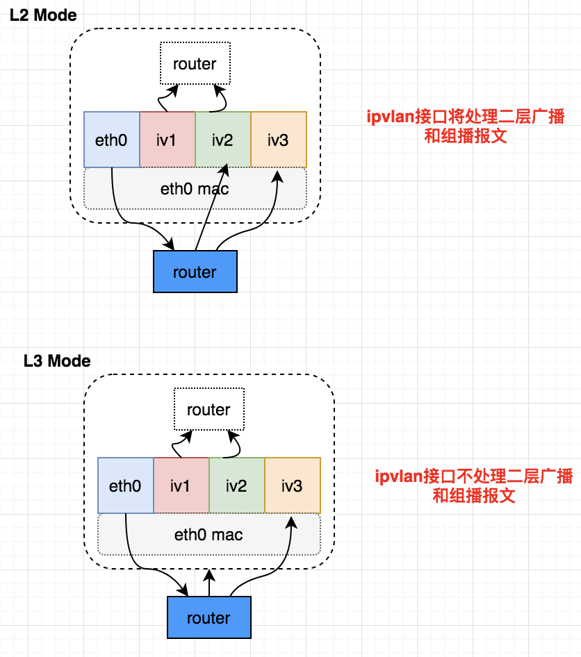

# ipvlan
## 概述
`ipvlan`是是linux kernel的一个network driver。
与macvlan不同的是，macvlan是通过MAC查找macvlan设备，而ipvlan是通过IP查找ipvlan设备。
* l2: the slaves will RX/TX multicast and broadcast (if applicable) as well.
* l3: the slaves will not receive nor can send multicast / broadcast traffic.

## 实践
### 环境
host1: 10.
### ipvlan l3
```sh
ip link add link bond0 ipvlan1 type ipvlan mode l3
ip link add link bond0 ipvlan2 type ipvlan mode l3

ip net add net-1
ip net add net-2
ip link set ipvlan1 netns net-1
ip link set ipvlan2 netns net-2

ip net exec net-1 ip addr add 100.0.2.18/24 dev ipvlan1
ip net exec net-2 ip addr add 100.0.3.18/24 dev ipvlan2

ip net exec net-1 ip link set up dev ipvlan1
ip net exec net-2 ip link set up dev ipvlan2

ip net exec net-1 ip route add default dev ipvlan1
ip net exec net-2 ip route add default dev ipvlan2
```
测试连通性：
```sh
[root@SCSP02115 ~]# ip net exec net-1 ping -c4 100.0.3.18
PING 100.0.3.18 (100.0.3.18) 56(84) bytes of data.
64 bytes from 100.0.3.18: icmp_seq=1 ttl=64 time=0.042 ms
64 bytes from 100.0.3.18: icmp_seq=2 ttl=64 time=0.042 ms
64 bytes from 100.0.3.18: icmp_seq=3 ttl=64 time=0.043 ms
64 bytes from 100.0.3.18: icmp_seq=4 ttl=64 time=0.047 ms

--- 100.0.3.18 ping statistics ---
4 packets transmitted, 4 received, 0% packet loss, time 3055ms
rtt min/avg/max/mdev = 0.042/0.043/0.047/0.006 ms
[root@SCSP02115 ~]# ip net exec net-2 ping -c4 100.0.2.18
PING 100.0.2.18 (100.0.2.18) 56(84) bytes of data.
64 bytes from 100.0.2.18: icmp_seq=1 ttl=64 time=0.042 ms
64 bytes from 100.0.2.18: icmp_seq=2 ttl=64 time=0.046 ms
64 bytes from 100.0.2.18: icmp_seq=3 ttl=64 time=0.047 ms
64 bytes from 100.0.2.18: icmp_seq=4 ttl=64 time=0.044 ms

--- 100.0.2.18 ping statistics ---
4 packets transmitted, 4 received, 0% packet loss, time 3095ms
rtt min/avg/max/mdev = 0.042/0.044/0.047/0.008 ms
```

### ipvlan l2
```sh
ip link add link bond0 ipvlan1 type ipvlan mode l2
ip link add link bond0 ipvlan2 type ipvlan mode l2

ip net add net-1
ip net add net-2

ip link set ipvlan1 netns net-1
ip link set ipvlan2 netns net-2

ip net exec net-1 ip link set ipvlan1 up
ip net exec net-2 ip link set ipvlan2 up

ip net exec net-1 ip addr add 100.0.2.18/24 dev ipvlan1
ip net exec net-2 ip addr add 100.0.3.18/24 dev ipvlan2

ip net exec net-1 route add default dev ipvlan1
ip net exec net-2 route add default dev ipvlan2

# ip net exec net-1 ip link set ipvlan1 up
# ip net exec net-2 ip link set ipvlan2 up
```
测试联通性：
```sh
[root@SCSP02115 ~]# ip netns exec net-1 ping -c4 100.0.3.18
PING 100.0.3.18 (100.0.3.18) 56(84) bytes of data.
64 bytes from 100.0.3.18: icmp_seq=1 ttl=64 time=0.076 ms
64 bytes from 100.0.3.18: icmp_seq=2 ttl=64 time=0.042 ms
64 bytes from 100.0.3.18: icmp_seq=3 ttl=64 time=0.048 ms
64 bytes from 100.0.3.18: icmp_seq=4 ttl=64 time=0.041 ms

--- 100.0.3.18 ping statistics ---
4 packets transmitted, 4 received, 0% packet loss, time 3075ms
rtt min/avg/max/mdev = 0.041/0.051/0.076/0.016 ms
[root@SCSP02115 ~]# ip netns exec net-2 ping -c4 100.0.2.18
PING 100.0.2.18 (100.0.2.18) 56(84) bytes of data.
64 bytes from 100.0.2.18: icmp_seq=1 ttl=64 time=0.041 ms
64 bytes from 100.0.2.18: icmp_seq=2 ttl=64 time=0.045 ms
64 bytes from 100.0.2.18: icmp_seq=3 ttl=64 time=0.041 ms
64 bytes from 100.0.2.18: icmp_seq=4 ttl=64 time=0.043 ms

--- 100.0.2.18 ping statistics ---
4 packets transmitted, 4 received, 0% packet loss, time 3108ms
rtt min/avg/max/mdev = 0.041/0.042/0.045/0.006 ms
```
