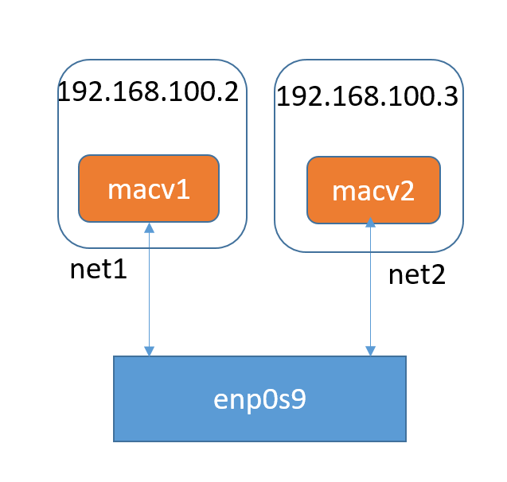
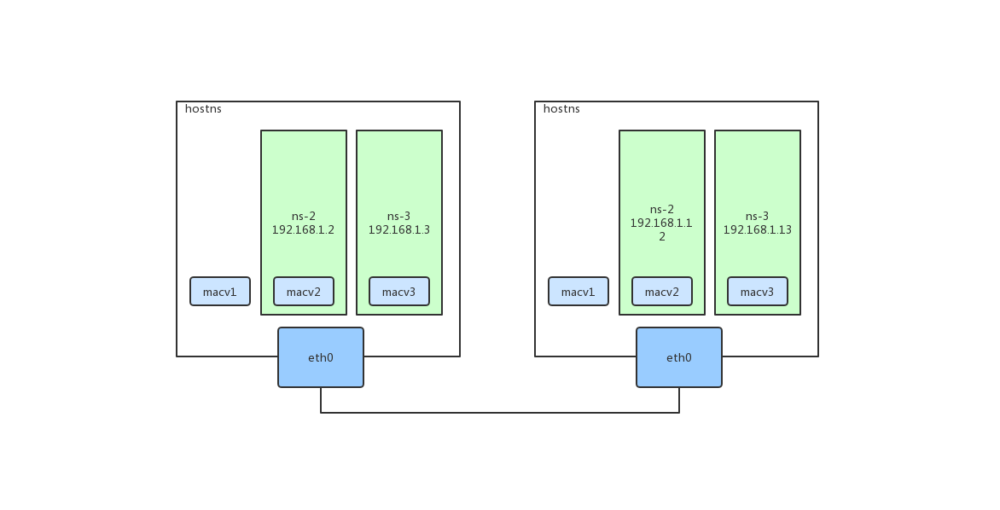

# macvlan
## 理论
`macvlan`与其说是网络虚拟化，不如说是网卡虚拟化。
### 技术特点
* 可以在一个实体网卡上虚拟出多个网卡，每个网卡具有独立的mac地址，可以配置独立的IP地址。
* 虚拟出来的macvlan网卡称为子接口，实体网卡称为父接口。
* 父接口可以是一个物理网卡，也可以是一个vlan子设备（eth0.100），也可以是bonding接口。
* 子接口与父接口无法直接通信。可以专门设置一个macvlan子接口给宿主机使用。可以认为"父接口消失"了，现在只有几个子接口存在。

`macvlan子接口具有独立的mac地址`。这一点是macvlan和ipvlan/vlan等技术创建出来的子网卡的最大区别。

父接口要开启`混杂`模式。

### 四种模式
* private mode：过滤掉所有来自其它macvlan接口的报文，因此不同的macvlan接口之间无法相互通信。
* vepa mode：virtual ethernet port aggragator，需要父接口连接的交换机支持vepa/802.1Qbg特性。所有子接口发送出去的报文都会通过父接口然后到达交换机，然后由交换机进行转发，哪怕目的地址是同一个父接口的macvlan子接口，即hairpin mode。这个模式下，所有macvlan子接口之间的通信流量也会经过交换机，适合于交换机进行过滤和统计的功能。
* bridge mode：相当于在不同的macvlan子接口之间创建了一个虚拟的交换机。不同macvlan子接口之间的通信不再需要通过外界的交换机。这个模式下交换机上看不到macvlan子接口之间的通信流量。
* passthru mode：直接把父接口和macvlan绑定在一起，这种模式一个父接口只能有一个macvlan虚拟网卡，并且子接口继承父接口的mac地址。

### 局限性
* Linux主机连接的交换机可能会限制同一个物理端口上的mac地址数量。
* 许多NIC也会对物理网卡上MAC地址数量进行限制。超过这个限制就会影响系统性能。
## 单机网络实践
### 环境说明
VirtualBox虚拟机，Centos 7.2。
```sh
uname -r
3.10.0-862.el7.x86_64
```
0. 检查内核是否支持macvlan
```sh
modprobe macvlan
lsmod | grep macvlan
macvlan                19239  0 
```
如果第一个命令报错，或者第二个命令没有返回，则说明当前系统不支持macvlan，需要升级系统或者升级内核。
1. 增加一个intnet类型的网卡，并开启混杂模式。
```
ip link set enp0s9 promisc on
```
查看网卡状态
```
4: enp0s9: <BROADCAST,MULTICAST,PROMISC,UP,LOWER_UP> mtu 1500 qdisc pfifo_fast state UP mode DEFAULT group default qlen 1000
    link/ether 08:00:27:d1:61:81 brd ff:ff:ff:ff:ff:ff
```
### 创建macvlan网络
以下将按照下图构建网络

1. 创建两个命名空间
```sh
ip netns add net1
ip netns add net2
```
2. 创建两个macvlan虚拟设备
```sh
ip link add link enp0s9 macv1 type macvlan mode bridge
ip link add link enp0s9 macv2 type macvlan mode bridge
```

3. 将设备分别加入net1和net2
```
ip link set macv1 netns net1
ip link set macv2 netns net2
```

4. 为macvlan设备配置ip
```sh
ip netns exec net1 ip addr add 192.168.100.2/24 dev macv1
ip netns exec net2 ip addr add 192.168.100.3/24 dev macv2
```
5. 开启macvlan设备
```sh
ip netns exec net1 ip link set macv1 up
ip netns exec net2 ip link set macv2 up
```

6. 分别查看设备
```sh
# ip netns exec net1 ip a
1: lo: <LOOPBACK> mtu 65536 qdisc noop state DOWN group default qlen 1000
    link/loopback 00:00:00:00:00:00 brd 00:00:00:00:00:00
6: macv1@if4: <BROADCAST,MULTICAST,UP,LOWER_UP> mtu 1500 qdisc noqueue state UNKNOWN group default qlen 1000
    link/ether ee:a6:31:31:97:bd brd ff:ff:ff:ff:ff:ff link-netnsid 0
    inet 192.168.100.2/24 scope global macv1
       valid_lft forever preferred_lft forever
    inet6 fe80::eca6:31ff:fe31:97bd/64 scope link 
       valid_lft forever preferred_lft forever

# ip netns exec net2 ip a
1: lo: <LOOPBACK> mtu 65536 qdisc noop state DOWN group default qlen 1000
    link/loopback 00:00:00:00:00:00 brd 00:00:00:00:00:00
7: macv2@if4: <BROADCAST,MULTICAST,UP,LOWER_UP> mtu 1500 qdisc noqueue state UNKNOWN group default qlen 1000
    link/ether f2:36:e5:c7:41:27 brd ff:ff:ff:ff:ff:ff link-netnsid 0
    inet 192.168.100.3/24 scope global macv2
       valid_lft forever preferred_lft forever
    inet6 fe80::f036:e5ff:fec7:4127/64 scope link 
       valid_lft forever preferred_lft forever
```

### 测试连通性
从net1中的macv1 ping net2中的macv2-192.168.100.3：
```sh
# ip netns exec net1 ping 192.168.100.3
PING 192.168.100.3 (192.168.100.3) 56(84) bytes of data.
64 bytes from 192.168.100.3: icmp_seq=1 ttl=64 time=0.297 ms
64 bytes from 192.168.100.3: icmp_seq=2 ttl=64 time=0.092 ms
64 bytes from 192.168.100.3: icmp_seq=3 ttl=64 time=0.096 ms
```
从net2中的macv2 ping net1中的macv1-192.168.100.2：
```sh
# ip netns exec net2 ping 192.168.100.2
PING 192.168.100.2 (192.168.100.2) 56(84) bytes of data.
64 bytes from 192.168.100.2: icmp_seq=1 ttl=64 time=0.052 ms
64 bytes from 192.168.100.2: icmp_seq=2 ttl=64 time=0.199 ms
64 bytes from 192.168.100.2: icmp_seq=3 ttl=64 time=0.095 ms
```

## 跨主机网络实践
### 网络架构图

### 实践命令
* 两台物理机host1和host2
* host1和host2的网卡bond0在二层联通

在host1上执行如下命令：
```sh
ip link add link bond0 macv1 type macvlan mode bridge

ip link add link bond0 macv2 type macvlan mode bridge
ip netns add net2
ip link set dev macv2 netns net2
ip netns exec net2 ip a add 192.168.1.2/24 dev macv2
ip netns exec net2 ip link set up dev macv2

ip link add link bond0 macv3 type macvlan mode bridge
ip netns add net3
ip link set dev macv3 netns net3
ip netns exec net3 ip a add 192.168.1.3/24 dev macv3
ip netns exec net3 ip link set up dev macv3

ip link set dev bond0 promisc on
```

在host2上执行如下命令：
```sh
ip link add link bond0 macv1 type macvlan mode bridge

ip link add link bond0 macv2 type macvlan mode bridge
ip netns add net2
ip link set dev macv2 netns net2
ip netns exec net2 ip a add 192.168.1.12/24 dev macv2
ip netns exec net2 ip link set up dev macv2

ip link add link bond0 macv3 type macvlan mode bridge
ip netns add net3
ip link set dev macv3 netns net3
ip netns exec net3 ip a add 192.168.1.13/24 dev macv3
ip netns exec net3 ip link set up dev macv3
```

### 测试网络联通性：
在host1上测试如下：
```sh
# ping相同host上的不同netns下的workload
ip netns exec net2 ping -c2 192.168.1.3
PING 192.168.1.3 (192.168.1.3) 56(84) bytes of data.
64 bytes from 192.168.1.3: icmp_seq=1 ttl=64 time=0.075 ms
64 bytes from 192.168.1.3: icmp_seq=2 ttl=64 time=0.045 ms

--- 192.168.1.3 ping statistics ---
2 packets transmitted, 2 received, 0% packet loss, time 1037ms
rtt min/avg/max/mdev = 0.045/0.060/0.075/0.015 ms

# ping不同host上的不同netns下的workload
ip netns exec net2 ping -c2 192.168.1.12
PING 192.168.1.12 (192.168.1.12) 56(84) bytes of data.
64 bytes from 192.168.1.12: icmp_seq=1 ttl=64 time=0.150 ms
64 bytes from 192.168.1.12: icmp_seq=2 ttl=64 time=0.144 ms

--- 192.168.1.12 ping statistics ---
2 packets transmitted, 2 received, 0% packet loss, time 1026ms
rtt min/avg/max/mdev = 0.144/0.147/0.150/0.003 ms

# ping不同host上的不同netns下的workload
ip netns exec net2 ping -c2 192.168.1.13
PING 192.168.1.13 (192.168.1.13) 56(84) bytes of data.
64 bytes from 192.168.1.13: icmp_seq=1 ttl=64 time=0.131 ms
64 bytes from 192.168.1.13: icmp_seq=2 ttl=64 time=0.111 ms

--- 192.168.1.13 ping statistics ---
2 packets transmitted, 2 received, 0% packet loss, time 1035ms
rtt min/avg/max/mdev = 0.111/0.121/0.131/0.010 ms
```
