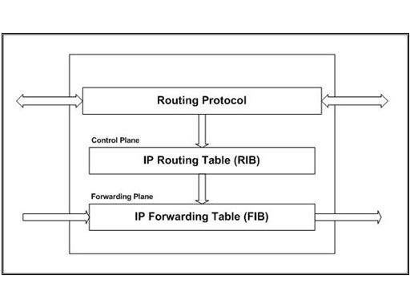

# 路由表(RIB)与转发表(FIB)
路由表(Routing Table, Routing Info Base)和转发表(Forwarding Info Base)是两种不同的表。它们共享相同的信息，但是用于不同的目的。

## RIB路由表
RIB存储所有的路由信息。
所有的路由协议都在这里保存它们的路由。只要路由器上运行的路由协议学到了新路由，就都会放到路由表中。

当目标地址不可达时，对应的路由条目先被标记为`Unreachable`，然后就从RIB中删除。

注意：RIB不是用来进行IP转发的，也不会被宣告到网络中。

总之，RIB中有：
* 所有通过动态路由协议学到的路由条目
* 所有的直连网络
* 另外配置的路由条目——如静态路由

理想状态下，我们应该用RIB来转发IP包。但实际上，路由表中的一些条目，比如静态和BGP路由，它们的下一跳并不是一个直连的网络。为了找到有效的下一跳，路由器必须进行递归查找，找到实际直连出口。

## FIB转发表
Forwarding Information Base转发表(FIB)用于判断基于IP包的网络前缀，如何进行转发。
对于每一条可达的目标网络前缀，FIB包含接口标识符和下一跳信息。
FIB概念上类似于路由表。它维护一份RIB表中的转发信息镜像。

当IP路由从RIB拷贝到FIB时，它们的下一跳信息被明确地分析出来，包括下一跳的具体端口，以及如果到下一跳有多条路径时，每条路径的具体端口。

FIB表中的条目数也是影响路由器性能的重要因素。
通常来讲，FIB条目越多，查找花费的时间越长。但由于基于ASIC芯片的转发技术日臻成熟，目前的查找转发几乎能达到线速。

路由器构建FIB需要一定的时间。它需要先接收路由信息包，建立路由表，选路，建立转发表并把转发表的适当的子集推送到一些线卡上，减少路由器CPU到线卡的压力。

对于特别大的FIB整个过程会需要大约几分钟——如RFC 3222所提及。

这种RIB加FIB的结构，使用控制平面的RIB和转发平面的FIB分离。
这种分离使路由器的性能更加有连续性。

## 注
FDB——Forwarding Database，适用于MAC地址转发。
