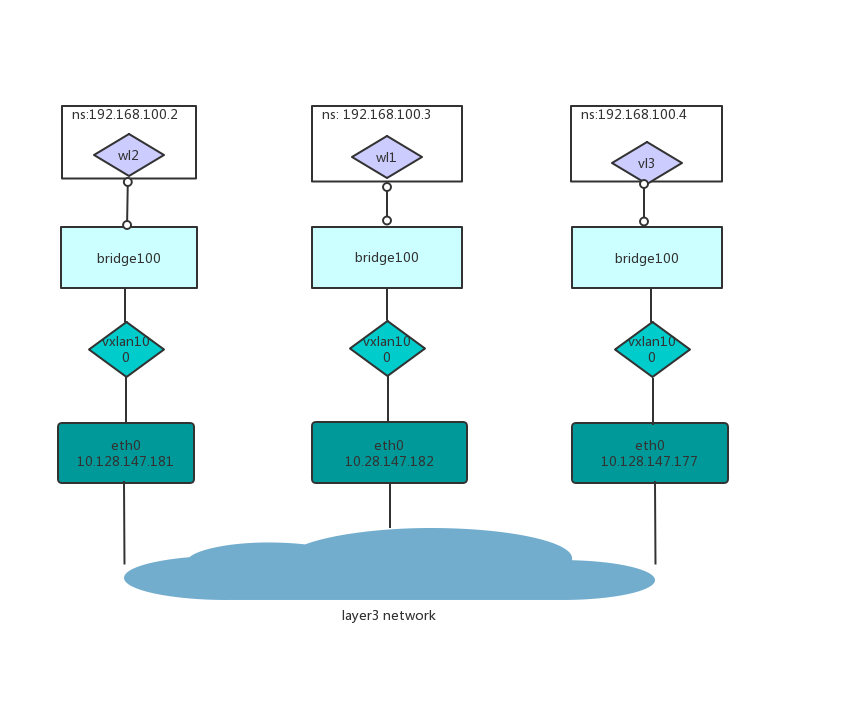
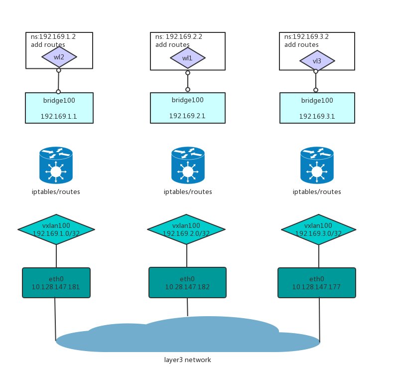

# VxLan
## 概述
Virutal eXtensible Local Area Network。
## 基本场景
### configure two hosts using remote

* host1: eth0, 10.128.147.181
* host2: eth0, 10.128.147.182

在host1执行如下命令：
```sh
ip link add vxlan100 type vxlan id 100 remote 10.128.147.182 dstport 4789 dev eth0
ip link set vxlan100 up
ip addr add 10.0.0.181/24 dev vxlan100
```

在host2执行如下命令：
```sh
ip link add vxlan100 type vxlan id 100 remote 10.128.147.181 dstport 4789 dev eth0
ip link set vxlan100 up
ip addr add 10.0.0.182/24 dev vxlan100
```

在这种模式下，通过remote分别指定了对端的vtep地址。

### configure more than 2 hosts without multicast
在底层主机不支持多播的情况下，如何配置vtep呢？

* host1: eth0, 10.128.147.181
* host2: eth0, 10.128.147.182
* host3: eth0, 10.128.147.177

在host1执行如下命令：
```sh
ip link add vxlan100 type vxlan id 100 dstport 0 dev eth0
bridge fdb append to 00:00:00:00:00:00 dst 10.128.147.182 dev vxlan100
bridge fdb append to 00:00:00:00:00:00 dst 10.128.147.177 dev vxlan100
ip addr add 192.168.200.1/24 dev vxlan100
ip link set up dev vxlan100
```

在host2执行如下命令：
```sh
ip link add vxlan100 type vxlan id 100 dstport 0 dev eth0
bridge fdb append to 00:00:00:00:00:00 dst 10.128.147.181 dev vxlan100
bridge fdb append to 00:00:00:00:00:00 dst 10.128.147.177 dev vxlan100
ip addr add 192.168.200.2/24 dev vxlan100
ip link set up dev vxlan100
```

在host3执行如下命令：
```sh
ip link add vxlan100 type vxlan id 100 dstport 0 dev eth0
bridge fdb append to 00:00:00:00:00:00 dst 10.128.147.181 dev vxlan100
bridge fdb append to 00:00:00:00:00:00 dst 10.128.147.182 dev vxlan100
ip addr add 192.168.200.3/24 dev vxlan100
ip link set up dev vxlan100
```
这种模式下通过手工维护bridge fdb表配置了任何两个host之间的vtep连接。

## 容器网络场景-大二层网络
### 网络架构



### 实践命令
在host1执行如下命令：
```sh
ip link add vxlan100 type vxlan id 100 dstport 0 dev eth0
bridge fdb append to 00:00:00:00:00:00 dst 10.128.147.182 dev vxlan100
bridge fdb append to 00:00:00:00:00:00 dst 10.128.147.177 dev vxlan100

ip link add dev br100 type bridge
ip link set vxlan100 master br100

ip link add dev veth1001 type veth peer name veth1002
ip link set veth1001 master br100

ip netns add net100
ip link set veth1002 netns net100
ip netns exec net100 ip addr add 192.168.100.2/24 dev veth1002

ip link set up dev vxlan100
ip link set up dev br100
ip link set up dev veth1001
ip netns exec net100 ip link set veth1002 name eth0
ip netns exec net100 ip link set up dev eth0
```

在host2执行如下命令：
```sh
ip link add vxlan100 type vxlan id 100 dstport 0 dev eth0
bridge fdb append to 00:00:00:00:00:00 dst 10.128.147.181 dev vxlan100
bridge fdb append to 00:00:00:00:00:00 dst 10.128.147.177 dev vxlan100

ip link add dev br100 type bridge
ip link set vxlan100 master br100

ip link add dev veth1001 type veth peer name veth1002
ip link set veth1001 master br100

ip netns add net100
ip link set veth1002 netns net100
ip netns exec net100 ip addr add 192.168.100.3/24 dev veth1002

ip link set up dev vxlan100
ip link set up dev br100
ip link set up dev veth1001
ip netns exec net100 ip link set veth1002 name eth0
ip netns exec net100 ip link set up dev eth0
```

在host3执行如下命令：
```sh
ip link add vxlan100 type vxlan id 100 dstport 0 dev eth0
bridge fdb append to 00:00:00:00:00:00 dst 10.128.147.181 dev vxlan100
bridge fdb append to 00:00:00:00:00:00 dst 10.128.147.182 dev vxlan100

ip link add dev br100 type bridge
ip link set vxlan100 master br100

ip link add dev veth1001 type veth peer name veth1002
ip link set veth1001 master br100

ip netns add net100
ip link set veth1002 netns net100
ip netns exec net100 ip addr add 192.168.100.4/24 dev veth1002

ip link set up dev vxlan100
ip link set up dev br100
ip link set up dev veth1001
ip netns exec net100 ip link set veth1002 name eth0
ip netns exec net100 ip link set up dev eth0
```

测试：
在host1上执行如下命令，验证网络的连通性。
```sh
[root@compute3 ~]# ip netns exec net100 ping -c4 192.168.100.3
PING 192.168.100.3 (192.168.100.3) 56(84) bytes of data.
64 bytes from 192.168.100.3: icmp_seq=1 ttl=64 time=0.797 ms
64 bytes from 192.168.100.3: icmp_seq=2 ttl=64 time=0.530 ms
64 bytes from 192.168.100.3: icmp_seq=3 ttl=64 time=0.460 ms
64 bytes from 192.168.100.3: icmp_seq=4 ttl=64 time=0.552 ms

--- 192.168.100.3 ping statistics ---
4 packets transmitted, 4 received, 0% packet loss, time 3072ms
rtt min/avg/max/mdev = 0.460/0.584/0.797/0.130 ms
[root@compute3 ~]# ip netns exec net100 ping -c4 192.168.100.4
PING 192.168.100.4 (192.168.100.4) 56(84) bytes of data.
64 bytes from 192.168.100.4: icmp_seq=1 ttl=64 time=0.334 ms
64 bytes from 192.168.100.4: icmp_seq=2 ttl=64 time=0.373 ms
64 bytes from 192.168.100.4: icmp_seq=3 ttl=64 time=0.435 ms
64 bytes from 192.168.100.4: icmp_seq=4 ttl=64 time=0.452 ms

--- 192.168.100.4 ping statistics ---
4 packets transmitted, 4 received, 0% packet loss, time 3099ms
rtt min/avg/max/mdev = 0.334/0.398/0.452/0.051 ms

```
### 总结
VxLan是在三层网络上构建二层网络，即L2 Over L3。
以上所有的容器都在一个二层网络里面。

VxLan的好处是不需要Underlay网络是一个二层网络。VLAN则需要Underlay网络是一个二层网络。

VxLan和VLAN都可以进行二层隔离。

以上方案也就是Bridge+VxLan模式实现的容器网络跨主机通信。

同理如果底层网络是二层网络，即ethernet fabric，把VxLan换成Vlan也是可以的。

## 容器网络场景-三层网络
### 网络架构



不同点：
* bridge设备与宿主机上的其它workload形成一个独立的而成网络，bridge设备配置为网关，每个workload增加到网关(bridge)的默认路由。
* vxlan设备不再加入bridge设备。vxlan和bridge以及宿主机上的workload在二层是不通的。
* vxlan设备配置ip地址，并且各个宿主机上的vxlan设备的ip地址是一个二层空间内（一个overlay的二层网络，和前面是一样的）
* 配置iptables和ip routes，并且开启linux的ip_forward功能，是的每个Linux宿主机开启路由转发功能。

### 实践命令
在host1执行如下命令：
```sh
ip link add vxlan100 type vxlan id 100 dstport 0 dev eth0
bridge fdb append to 00:00:00:00:00:00 dst 10.128.147.182 dev vxlan100
bridge fdb append to 00:00:00:00:00:00 dst 10.128.147.177 dev vxlan100
ip addr add 192.169.1.0/32 dev vxlan100
ip link set up dev vxlan100
ip route add 192.169.2.0/32 dev vxlan100
ip route add 192.169.3.0/32 dev vxlan100

ip link add dev br100 type bridge
ip addr add 192.169.1.1/24 dev br100

ip link add dev veth1001 type veth peer name veth1002
ip link set veth1001 master br100

ip netns add net100
ip link set veth1002 netns net100
ip netns exec net100 ip addr add 192.169.1.2/24 dev veth1002

ip link set up dev br100
ip link set up dev veth1001
ip netns exec net100 ip link set veth1002 name eth0
ip netns exec net100 ip link set up dev eth0

ip netns exec net100 ip route add default via 192.169.1.1 dev eth0

ip route add 192.169.2.0/24 via 192.169.2.0 dev vxlan100
ip route add 192.169.3.0/24 via 192.169.3.0 dev vxlan100

iptables -t filter -A FORWARD -s 192.169.0.0/16 -j ACCEPT
iptables -t filter -A FORWARD -d 192.169.0.0/16 -j ACCEPT
```

其中路由条目`192.169.1.0/24 dev br100 proto kernel scope link src 192.169.1.1`会在br100 up时自动增加。

在host2执行如下命令：
```sh
ip link add vxlan100 type vxlan id 100 dstport 0 dev eth0
bridge fdb append to 00:00:00:00:00:00 dst 10.128.147.181 dev vxlan100
bridge fdb append to 00:00:00:00:00:00 dst 10.128.147.177 dev vxlan100
ip addr add 192.169.2.0/32 dev vxlan100
ip link set up dev vxlan100
ip route add 192.169.1.0/32 dev vxlan100
ip route add 192.169.3.0/32 dev vxlan100

ip link add dev br100 type bridge
ip addr add 192.169.2.1/24 dev br100

ip link add dev veth1001 type veth peer name veth1002
ip link set veth1001 master br100

ip netns add net100
ip link set veth1002 netns net100
ip netns exec net100 ip addr add 192.169.2.2/24 dev veth1002

ip link set up dev br100
ip link set up dev veth1001
ip netns exec net100 ip link set veth1002 name eth0
ip netns exec net100 ip link set up dev eth0

ip netns exec net100 ip route add default via 192.169.2.1 dev eth0

ip route add 192.169.1.0/24 via 192.169.1.0 dev vxlan100
ip route add 192.169.3.0/24 via 192.169.3.0 dev vxlan100

iptables -t filter -A FORWARD -s 192.169.0.0/16 -j ACCEPT
iptables -t filter -A FORWARD -d 192.169.0.0/16 -j ACCEPT
```

其中路由条目`192.169.2.0/24 dev br100 proto kernel scope link src 192.169.2.1`会在br100 up时自动增加。

在host3执行如下命令：
```sh
ip link add vxlan100 type vxlan id 100 dstport 0 dev eth0
bridge fdb append to 00:00:00:00:00:00 dst 10.128.147.181 dev vxlan100
bridge fdb append to 00:00:00:00:00:00 dst 10.128.147.182 dev vxlan100
ip addr add 192.169.3.0/32 dev vxlan100
ip link set up dev vxlan100
ip route add 192.169.1.0/32 dev vxlan100
ip route add 192.169.2.0/32 dev vxlan100

ip link add dev br100 type bridge
ip addr add 192.169.3.1/24 dev br100

ip link add dev veth1001 type veth peer name veth1002
ip link set veth1001 master br100

ip netns add net100
ip link set veth1002 netns net100
ip netns exec net100 ip addr add 192.169.3.2/24 dev veth1002

ip link set up dev br100
ip link set up dev veth1001
ip netns exec net100 ip link set veth1002 name eth0
ip netns exec net100 ip link set up dev eth0

ip netns exec net100 ip route add default via 192.169.3.1 dev eth0

ip route add 192.169.1.0/24 via 192.169.1.0 dev vxlan100
ip route add 192.169.2.0/24 via 192.169.2.0 dev vxlan100

iptables -t filter -A FORWARD -s 192.169.0.0/16 -j ACCEPT
iptables -t filter -A FORWARD -d 192.169.0.0/16 -j ACCEPT
```

其中路由条目`192.169.3.0/24 dev br100 proto kernel scope link src 192.169.3.1`会在br100 up时自动增加。

验证网络联通性
```sh
[root@compute3 ~]# ip netns exec net100 ping -c4 192.169.2.2
PING 192.169.2.2 (192.169.2.2) 56(84) bytes of data.
64 bytes from 192.169.2.2: icmp_seq=1 ttl=62 time=0.816 ms
64 bytes from 192.169.2.2: icmp_seq=2 ttl=62 time=0.486 ms
64 bytes from 192.169.2.2: icmp_seq=3 ttl=62 time=0.580 ms
64 bytes from 192.169.2.2: icmp_seq=4 ttl=62 time=0.543 ms

--- 192.169.2.2 ping statistics ---
4 packets transmitted, 4 received, 0% packet loss, time 3068ms
rtt min/avg/max/mdev = 0.486/0.606/0.816/0.126 ms
[root@compute3 ~]# ip netns exec net100 ping -c4 192.169.3.2
PING 192.169.3.2 (192.169.3.2) 56(84) bytes of data.
64 bytes from 192.169.3.2: icmp_seq=1 ttl=62 time=0.489 ms
64 bytes from 192.169.3.2: icmp_seq=2 ttl=62 time=0.418 ms
64 bytes from 192.169.3.2: icmp_seq=3 ttl=62 time=0.409 ms
64 bytes from 192.169.3.2: icmp_seq=4 ttl=62 time=0.381 ms

--- 192.169.3.2 ping statistics ---
4 packets transmitted, 4 received, 0% packet loss, time 3095ms
rtt min/avg/max/mdev = 0.381/0.424/0.489/0.042 ms

```

### 总结
该网络方案总共牵涉到N+1+1个网络。
1：一个物理机之间的IP网络。
2：一个overlay的vxlan网络。
3：N个宿主机上独立的容器网络。

然后每个宿主机作为vrouter（通过配置路由表和iptables规则）连接宿主机容器网络和vxlan网络，如此所有的网络都是相通的。

上面看到，所有的路由表和iptables以及vxlan的bridge fdb规则都是人工添加的。能不能自动化呢？

当然可以。

如果我们在每个宿主机上运行一个进程，监听这些容器的变化，然后添加相应的规则。如此实现一个基本的的SDN控制器，那么一个简单的SDN网络方案就实现了。

如上所述其实就是Flannel的作用，以上网络方案其实也就是Flannel+VxLAN的方案。

假设物理主机都在一个二层网络里，那么就不需要通过Overlay的方式来构建二层网络，可以直接配置路由表，是宿主机二层相通，那就是Flannel+HostGateway的方式了。

