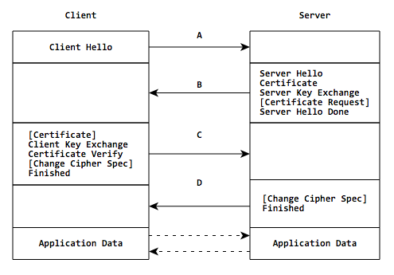

# HTTPS通信
## HTTPS通信过程概述
HTTPS的通信过程如下图所示：



**1. 客户端发出握手请求（client hello），包含以下信息：**

* 支持的协议版本，比如TLS1.0版
* 一个客户端生成的随机数（**client_random**），这个随机数既需要客户端保存又要发送给服务器
* 支持的加密方法，比如RSA公钥加密
* 支持的压缩方法

**2. 服务器回复（server hello），包含以下信息：**

* 确认使用的加密通信协议版本，比如TLS1.0版本。如果浏览器与服务器支持的版本不一致，服务器关闭加密通信
* 一个服务器生成的随机数（**server_random**）
* 确认使用的加密方法，比如RSA公钥加密
* **服务器证书**

**3. 客户端回应，包含以下步骤：**

* 验证服务器证书的合法性，证书合法性包括：证书是否过期，发行服务器证书的**CA**是否可靠，证书发行者的公钥能否正确解开服务器证书的“发行者数字签名”，服务器证书上的域名是否和服务器的实际域名相匹配。如果合法性验证没有通过，通讯断开
* 客户端使用一些加密算法产生一个48个字节的key，这个key叫做**PreMaster Secret**。该PreMaster Secret用服务器的公钥加密传送，防止被窃听，只有服务器使用私钥才能解开
* 编码改变通知，表示随后的信息都将用双方商定的加密方法和密钥发送
* 客户端握手结束通知，表示客户端的握手阶段已经结束。这一项同时也是前面发送的所有内容的hash值，用来供服务器校验

**4. 服务器回应**

服务器通过上面的三个随机数（client_random，server_random和PreMaster Secret），计算出本次会话的**会话密钥（session secret）**，然后向客户端发送下面信息：

* 编码改变通知，表示随后的信息都将用双方商定的加密方法和密钥发送
* 服务器端握手结束通知，表示服务器端握手阶段已经结束。这一项同时也是前面发送的所有内容的hash值，用来供客户端校验

至此，服务器端和客户端的握手阶段全部结束，接下来，客户端和服务器端进入加密通信，就完全时使用普通的HTTP协议，只不过用**会话密钥（session secret）**对内容做对称加密。

## PreMaster Secret说明
PreMaster secret时在客户端使用RSA或者Diffie-Hellman等加密算法生成的。它将用来与服务器和客户端在Hello阶段产生的随机数结合一起生成Master Secret。

PreMaster secret由客户端使用服务器端的公钥加密之后传送给服务器，服务器使用私钥解开的到PreMaster secret。也就是说服务器端和客户端都有一份完全相同的PreMaster secret和随机数。

PreMaster secret长度为48个字节，前2个子节时协议版本号，剩下的46个字节填充一个随机数。结构如下：

``` c
Struct {
    byte Version[2];
    byte random[46];
}
```
PreMaster secret前两个字节是TLS的版本号，这是一个比较重要的用来核对握手数据的版本号，因为在Client Hello阶段，客户端会发送一份加密套件列表和当前支持的SSL/TLS的版本号给服务端，而且是使用明文传送的，如果握手的数据包被破解之后，攻击者很有可能篡改数据包，选择一个安全性较低的加密套件和版本给服务端，从而对数据进行破解。所以，服务端需要对密文中解密出来对的PreMaster版本号跟之前Client Hello阶段的版本号进行对比，如果版本号变低，则说明被篡改，立即停止发送任何消息。

## Master Secret说明
上面握手过程中产生过三个随机数（client_random，server_random和PreMaster Secret），而且服务器端和客户端都保留着这三个值。

客户端和服务器端通过这3个值计算出同样的Master Secret。 Master Secret是由系列的hash值组成的，结构如下：


其中，Client/Server write MAC key是用来对数据进行验证的，Client/Server write encryption Key是用来对数据进行加解密的会话密钥(session secret)。

至于为什么一定要用三个随机数，来生成Master Secret，由于SSL协议中证书是静态的，因此需要引入一种随机因素来保证协商出来的密钥的随机性。SSL协议不信任每个主机都能生成完全随机的随机数，所以这里需要服务器和客户端共生成3个随机数，每增加一个自由度，随机性就会相应增加。

同时需要注意**前两个随机数都是明文传输的**，窃听者是可以轻易获取到的，只有最后一个PreMaster Secret是加密传输的，只有拥有服务器私钥才能解密，一旦PreMaster Secret泄露，那么本次通信就就完全可被破解了。

## 应用数据传输

在所有的握手阶段都完成之后，就可以开始传送应用数据了。应用数据在传输之前，首先要附加上MAC secret，然后再对这个数据包使用write encryption key进行加密。在服务端收到密文之后，使用Client write encryption key进行解密，客户端收到服务端的数据之后使用Server write encryption key进行解密，然后使用各自的write MAC key对数据的完整性包括是否被串改进行验证。


