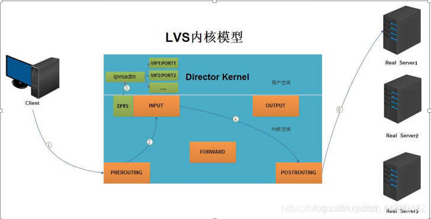

# LVS
## 概念
`lvs`是linux virtual server的简称，也就是Linux虚拟服务器。这是一个开源项目，它的官方网站是http://www.linuxvirtualserver.org。现在lvs已经是linux内核标准的一部分。

使用lvs可以达到的技术目标是：通过lvs的负载均衡技术和linux操作系统实现一个高性能高可用的linux服务器集群，它具有良好的可靠性、可扩展性和可操作性，从而以低廉的成本实现最优的性能。

## 特点
LVS的主要特点有以下几个方面：
* 高并发连接：LVS基于内核网络层工作，有超强的承载能力和并发处理能力。单台LVS负载均衡器，可支持上万并发连接。
* 稳定性强：工作在网络4层之上仅作分发之用，这个特点也决定了它在负载均衡软件里性能最强，稳定性最好，对内存和cpu资源消耗极低。
* 成本低廉：硬件负载均衡器少则十几万，多则几十万上百万，LVS只需一台服务器，就能免费部署使用，性价比极高。
* 配置简单：LVS配置非常简单，仅需几行命令即可完成配置，也可写成脚本进行管理。
* 支持多种算法：支持多种论调算法，可根据业务场景灵活调配进行使用。
* 支持多种工作模型：可根据业务场景，使用不同的工作模式来解决生产环境请求处理问题。
* 应用范围广：因为LVS工作在4层，所以它几乎可以对所有应用做负载均衡，包括http、数据库、DNS、ftp服务等

缺点：工作在4层，不支持7层规则修改，机制过于庞大，不适合小规模应用。

## 工作原理

1. 当客户端的请求到达负载均衡器的内核空间时，首先会到达PREROUTING链。
2. 当内核发现请求数据包的目的地址是本机时，将数据包送往INPUT链。
3. LVS由用户空间的ipvsadm和内核空间的IPVS组成，ipvsadm用来定义规则，IPVS利用ipvsadm定义的规则工作。IPVS工作在INPUT链上，当数据包到达INPUT链时，首先会被IPVS检查，如果数据包里面的目的地址及端口`没有`在规则里面，那么这条数据包将经过INPUT链送至用户空间，交给用户空间的进程来处理。
4. 如果数据包里面的目的地址及端口`在`规则里面，那么这条数据报文将被修改目的地址为事先定义好的后端服务器，并送往POSTROUTING链。
5. 最后经由POSTROUTING链发往后端服务器。