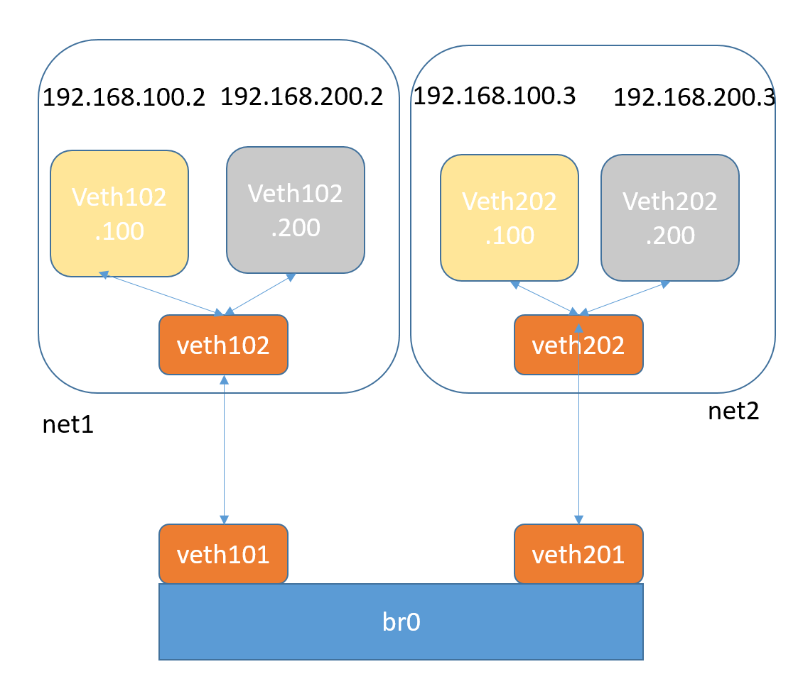

# Linux Vlan简单实践
## VLAN基本概念
VLAN，又称**虚拟网络**，是一个被广泛使用的概念。
此处主要说的是在物理世界中存在的，需要协议支持的**VLAN**。
它的种类很多，按照协议原理一般分为：
* MACVLAN
* 802.1.q VLAN
* 802.1.qbg VLAN
* 802.1.qbh VLAN
其中出现较早，应用广泛并且比较成熟的是**802.1.q VLAN**，其基本原理是在二层协议里插入额外的VLAN协议数据（称为 802.1.q VLAN Tag)，同时保持和传统二层设备的兼容性。

Linux里的VLAN设备是对802.1.q协议的一种内部软件实现，模拟现实世界中的802.1.q交换机。

Linux里802.1.q VLAN设备是以**母子关系成对出现**的。
* 母设备相当于现实世界中的交换机TRUNK口，用于连接上级网络
* 子设备相当于普通接口用于连接下级网络。
当数据在母子设备间传递时，内核将会根据802.1.q VLAN Tag进行对应操作。母子设备之间是一对多的关系，一个母设备可以有多个子设备，一个子设备只有一个母设备。当一个子设备有一包数据需要发送时，数据将被加入VLAN Tag然后从母设备发送出去。当母设备收到一包数据时，它将会分析其中的VLAN Tag，如果有对应的子设备存在，则把数据转发到那个子设备上并根据设置移除VLAN Tag，否则丢弃该数据。

在某些设置下，VLAN Tag可以不被移除以满足某些监听程序的需要，如DHCP服务程序。
举例说明如下：eth0作为母设备创建一个ID为100的子设备eth0.100。此时如果有程序要求从eth0.100 发送一包数据，数据将被打上 VLAN 100的Tag，从eth0发送出去。如果eth0收到一包数据，VLAN Tag是100，数据将被转发到eth0.100上，并根据设置决定是否移除 VLAN Tag。如果eth0收到一包包含VLAN Tag 101的数据，其将被丢弃。上述过程隐含以下事实：**对于寄主Linux系统来说，母设备只能用来收数据，子设备只能用来发送数据**。

和Bridge一样，**母子设备的数据也是有方向的，子设备收到的数据不会进入母设备，同样母设备上请求发送的数据不会被转到子设备上**。可以把VLAN母子设备作为一个整体想象为现实世界中的802.1.q交换机，下级接口通过子设备连接到寄主Linux系统网络里，上级接口同过主设备连接到上级网络，当母设备是物理网卡时上级网络是外界真实网络，当母设备是另外一个Linux虚拟网络设备时上级网络仍然是寄主Linux系统网络。

需要注意的是母子VLAN设备拥有**相同的MAC地址**，可以把它当成现实世界中802.1.q交换机的MAC，因此多个VLAN设备会共享一个 MAC。

当一个母设备拥有多个VLAN子设备时，子设备之间是隔离的，不存在Bridge那样的交换转发关系，原因如下：802.1.q VLAN协议的主要目的是从逻辑上隔离子网。
现实世界中的802.1.q交换机存在多个VLAN，每个VLAN 拥有多个端口，同一VLAN端口之间可以交换转发，不同VLAN端口之间隔离，所以其包含两层功能：交换与隔离。

**Linux VLAN device实现的是隔离功能，没有交换功能**。一个VLAN母设备不可能拥有两个相同ID的VLAN子设备，因此也就不可能出现数据交换情况。如果想让一个VLAN里接多个设备，就需要交换功能。在Linux里 Bridge专门实现交换功能，因此将VLAN子设备attach到一个Bridge上就能完成后续的交换功能。

总结起来，Bridge加VLAN device能在功能层面完整模拟现实世界里的802.1.q交换机。

## 环境说明
VirtualBox虚拟机，Centos 7.2。
```sh
uname -r
3.10.0-862.el7.x86_64
```
安装bridge-utils软件包，并加载bridge模块和开启内核转发。
```sh
apt-get install bridge-utils
modprobe bridge

echo "1">/proc/sys/net/ipv4/ip_forward

cat /proc/sys/net/ipv4/ip_forward
1
```
## 实践
下面将按照如下图构建网络。

### 创建虚拟设备
创建网桥，用来将2个vlan合在一起实现交换功能。
```sh
ip link add dev br0 type bridge
```
创建2个network namespace。
```sh
ip netns add net1
ip netns add net2
```
创建第一个虚拟交换机
```sh
ip link add dev veth101 type veth peer name veth102
ip link set dev veth101 master br0
ip link set dev veth102 netns net1

ip netns exec net1 ip link add dev veth102.100 link veth102 type vlan id 100
ip netns exec net1 ip link add dev veth102.200 link veth102 type vlan id 200

ip netns exec net1 ip addr add 192.168.100.2/24 dev veth102.100
ip netns exec net1 ip addr add 192.168.200.2/24 dev veth102.200

ip netns exec net1 ip link set dev veth102 up
ip netns exec net1 ip link set dev veth102.100 up
ip netns exec net1 ip link set dev veth102.200 up
ip link set veth101 up
```
创建第二个虚拟交换机
```sh
ip link add dev veth201 type veth peer name veth202
ip link set dev veth201 master br0
ip link set dev veth202 netns net2

ip netns exec net2 ip link add dev veth202.100 link veth202 type vlan id 100
ip netns exec net2 ip link add dev veth202.200 link veth202 type vlan id 200

ip netns exec net2 ip addr add 192.168.100.3/24 dev veth202.100
ip netns exec net2 ip addr add 192.168.200.3/24 dev veth202.200

ip netns exec net2 ip link set dev veth202 up
ip netns exec net2 ip link set dev veth202.100 up
ip netns exec net2 ip link set dev veth202.200 up
ip link set veth201 up
```
启用br0设备
```sh
ip link set br0 up
```

### 连通性
1. 从net1中的虚拟子网(100)中的设备veth102.100 ping net2中虚拟子网(100)中的ip
```sh
ip netns exec net1 ping 192.168.100.3 -c 4 -I veth102.100
PING 192.168.100.3 (192.168.100.3) from 192.168.100.2 veth102.100: 56(84) bytes of data.
64 bytes from 192.168.100.3: icmp_seq=1 ttl=64 time=0.129 ms
64 bytes from 192.168.100.3: icmp_seq=2 ttl=64 time=0.118 ms
64 bytes from 192.168.100.3: icmp_seq=3 ttl=64 time=0.118 ms
64 bytes from 192.168.100.3: icmp_seq=4 ttl=64 time=0.131 ms
```
2. 从net1中的虚拟子网(200)中的设备veth102.200 ping net2中虚拟子网(100)中的ip
```sh
ip netns exec net1 ping 192.168.100.3 -c 4 -I veth102.200
PING 192.168.100.3 (192.168.100.3) from 192.168.200.2 veth102.200: 56(84) bytes of data.
^C
--- 192.168.100.3 ping statistics ---
3 packets transmitted, 0 received, 100% packet loss, time 1999ms
```
3. 从net1中的虚拟子网(200)中的设备veth102.200 ping net2中虚拟子网(200)中的ip
```sh
ip netns exec net1 ping 192.168.200.3 -c 4 -I veth102.200
PING 192.168.200.3 (192.168.200.3) from 192.168.200.2 veth102.200: 56(84) bytes of data.
64 bytes from 192.168.200.3: icmp_seq=1 ttl=64 time=0.086 ms
64 bytes from 192.168.200.3: icmp_seq=2 ttl=64 time=0.156 ms
```
4. 从net1中的虚拟子网(100)中的设备veth102.100 ping net2中虚拟子网(200)中的ip
```sh
ip netns exec net1 ping 192.168.200.3 -c 4 -I veth102.100
PING 192.168.200.3 (192.168.200.3) from 192.168.100.2 veth102.100: 56(84) bytes of data.
^C
--- 192.168.200.3 ping statistics ---
2 packets transmitted, 0 received, 100% packet loss, time 999ms
```


