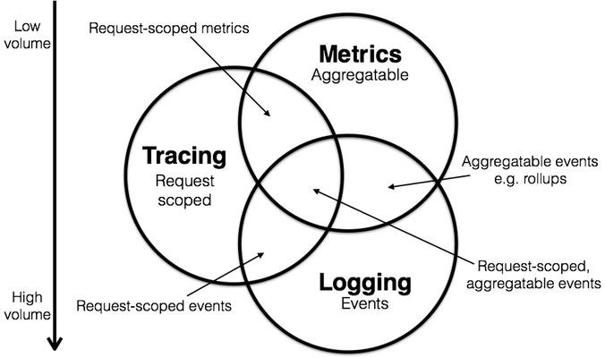
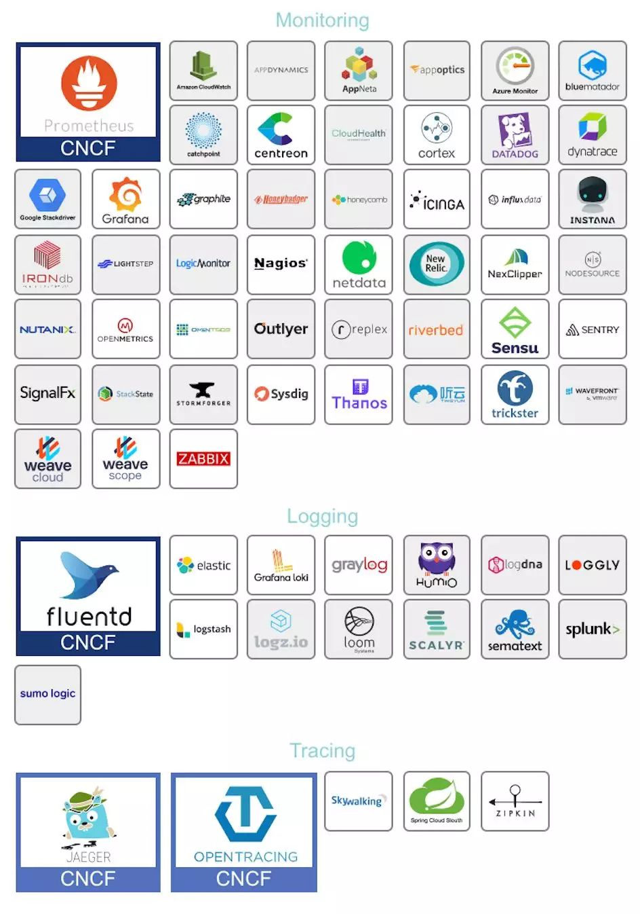

# 服务的可观察性——Observability

## 三大支柱
可观察性目前主要包含以下三大支柱：
* 日志(Logging)：Logging主要记录一些离散的事件，应用往往通过将定义好格式的日志信息输出到文件，然后用日志收集程序收集起来用于分析和聚合。目前已经有ELK这样的成熟方案, 相比之下日志记录的信息最为全面和丰富，占用的存储资源正常情况下也最多，虽然可以用时间将所有日志点事件串联起来，但是却很难展示完整的调用关系路径；
* 度量(Metrics)：Metric往往是一些聚合的信息，相比Logging丧失了一些具体信息，但是占用的空间要比完整日志小的多，可以用于监控和报警，在这方面Prometheus已经基本上成为了事实上的标准；
* 分布式追踪(Tracing)：Tracing介于Logging和Metric之间，以请求的维度，串联服务间的调用关系并记录调用耗时，既保留了必要的信息，又将分散的日志事件通过Span串联，帮助我们更好的理解系统的行为、辅助调试和排查性能问题，也是本文接下来介绍的重点。

## 主流方案

