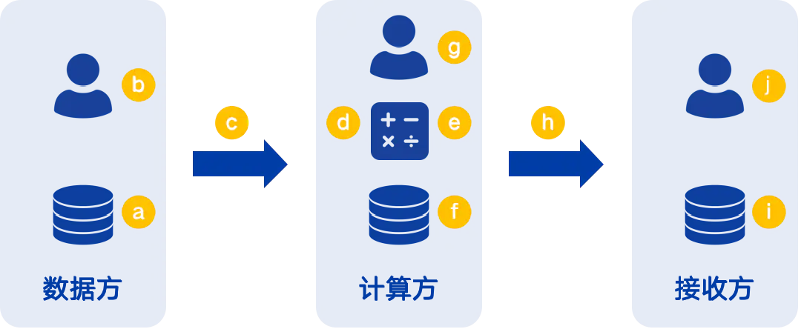
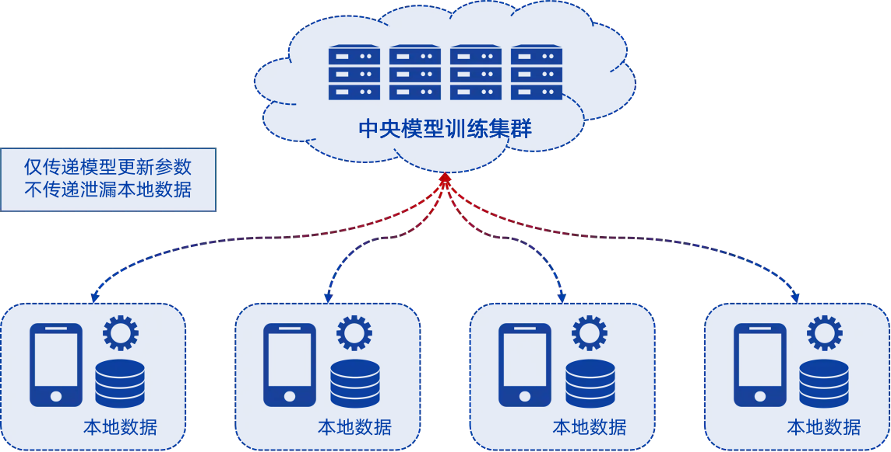
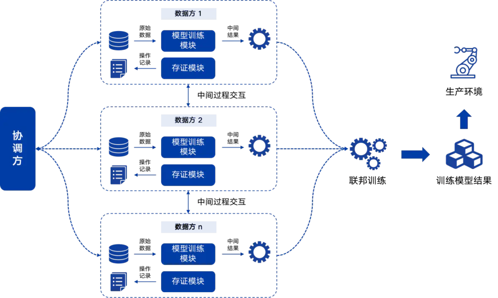
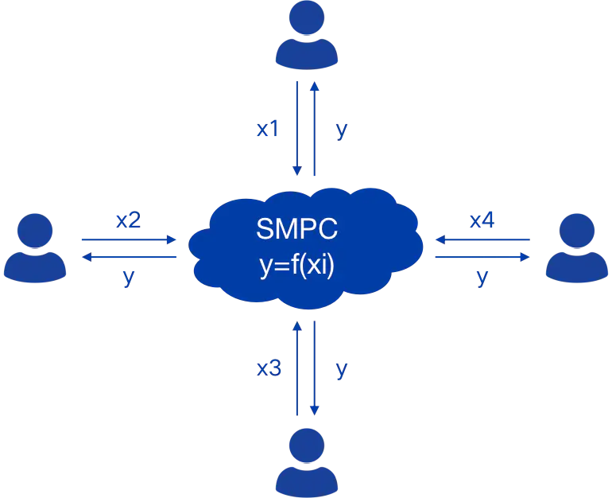

# 隐私保护计算
## 基本概念
### 隐私保护计算的定义
* 隐私保护计算（Privacy-Preserving Computing）是指在保护隐私信息的前提下，实现数据价值的分析和挖掘，即实现数据在加密的、非透明的状态下的计算，以保护计算各参与方的隐私信息安全。
* 隐私保护计算不是某项单点技术，而是一套技术体系，涉及密码学、分布式计算、人工智能、数据科学等众多领域。
* 隐私保护计算实现的是数据背后的价值和知识的流动和共享，真正实现“数据可用不可见”。

### 隐私保护计算的基本架构
* 隐私保护计算架构体系中，分为三个逻辑角色：数据方、计算方和结果方。
    * 数据方是提供数据的组织或个人。
    * 计算方是提供算力的组织或个人。
    * 结果方是接收结果的组织或个人。
* 隐私保护计算实际部署中，实体至少要有两个，每个实体可以参与数据方、计算方或结果方中的一个或多个。

### 隐私保护计算的目标
* 隐私保护计算体系各环节的风险为：
    1. 数据方数据静态存储风险
    2. 数据方数据使用泄密风险
    3. 数据从数据方传输到计算方的传输风险
    4. 数据在计算方计算前的泄密风险
    5. 数据在计算方计算后的泄密风险
    6. 计算方数据静态存储风险
    7. 计算方数据使用泄密风险
    8. 数据从计算方传输到接收方的传输风险
    9. 接收方数据静态存储风险
    10. 接收方数据使用泄密风险

* 对于隐私数据的全生命周期防护过程，数据静态存储和数据传输的安全防护技术已经比较成熟，比如访问控制、存储加密、传输加密、内容审计等。而隐私计算保护，则专注于`数据计算过程和计算结果`的隐私保护，补齐隐私数据保护技术栈的短板。

### 隐私保护计算的价值

* 打破数据孤岛。原始数据不出库，知识和价值出库，构建“数据可用不可见”的新模式，促进数据高效流转和共享交换。
* 安全合规避险。欧盟PRACTICE项目依据GDPR论证了爱沙尼亚安全多方计算（1000万条纳税记录和60万学历信息的关联统计分析）的合规性，为欧洲高效数据流通树立典范。
* 弥合信任鸿沟。隐私保护计算技术栈依靠坚实的理论基础和安全性证明，从技术角度真正实现数据所有者的权利和数据使用者的义务之间的平衡，构建了信任基础。

## 关键技术
### 联邦学习（Federated Learning，FL）
联邦学习最初由Google提出，用于解决由一个中央服务器协调众多分散的智能终端实现语言预测模型的更新。其工作原理是：
* 分布式的智能终端从中央服务器下载即有的预测模型，通过本地数据对模型进行训练，并将训练后的模型更新结果上传到中央服务器；
* 中央服务器对来自不同智能终端的模型更新进行融合，优化预测模型；
* 分布式的智能终端从中央服务器下载优化后的预测模型，用于实际的业务处理，同时重复这个“下载”-“训练”-“上传”-“更新”的过程。

联邦学习的理念是保证数据不出安全控制范围的前提下，多方共同协作构建机器学习的模型，是一种训练数据分布式部署，实现参与方隐私数据保护的特殊的分布式计算方式。理论上可以取得和中心化机器学习模型训练近似的性能。

跟据训练数据的特征空间和样本空间的分布差异，FL分为三类:
* 横向联邦学习
* 纵向联邦学习
* 迁移联邦学习。

联邦学习的典型架构

典型的联邦学习中，主要包含“协调方”、“数据方”和“结果方”三种角色。“数据方”是提供联邦建模训练所需的私有数据的参与方；“协调方”是协调各参与方进行协作训练的参与方；“结果方”是使用最终联邦训练模型的参与方，同一个参与方可以同时承担三种角色。联邦学习常见的算法有线性回归、逻辑回归、神经网络等。

联邦学习的安全性评估
1. 理想情况下，联邦学习在模型训练和推理的阶段，各参与方只能获得其计算的必要过程数据和结果数据，也就是基于交互的有限数据无法推导出原始隐私数据。但现实为了兼顾实用性和公平性，往往要做一定的妥协。
2. 联邦学习存在一定的安全问题：
    * 梯度带来的隐私泄露问题。虽然原始数据不出库，但梯度几乎包含原始数据信息，存在反向推导的问题。虽然原理上可以通过差分隐私添加噪声实现隐私保护，但这样会影响机器学习模型的收敛速度，对模型京精度产生损失；
    * 基于半同态加密（SHE）的单向隐私保护问题。部分纵向联邦学习技术采用SHE对中间过程结果进行加密，只能实现对私钥持有方的单向隐私保护。
    * 隐私求交的隐私泄漏问题。基于PSI（Private Set Intersection）协议，能够对非交集内的样本进行保护，但交集内的样本仍是明文，存在泄漏的风险。

### 安全多方计算（Secure Multi-Party Computation，SMPC）

* 安全对方计算最初由图灵奖获得者姚期智院士提出，用于解决“百万富翁问题”的一个算法设想。
* 安全多方计算解决的是一组相互不信任的参与方各自拥有秘密数据，`协同计算一个既定函数`的问题。参与方除了获得计算结果，无法获得之外的任何信息。在整个计算过程中，参与方拥有对自身数据的绝对控制权。
* 安全多方计算逻辑架构：同一个分布式网络中，有n个参与方P1，P2，P3，…，Pn，各自拥有自己的秘密数据xi(i=1,2,3,…,n)，它们共同执行既定的函数y=f(x1,x2,x3…,xi)，y为Pi的执行结果。Pi除了y得不到任何其他信息。

* 安全多方计算的关键技术选型:
    * 秘密分享（Secret Sharing）
    * 混淆电路（Garbeld Circuit）
    * 不经意传输（Oblivious Transfer）
* 安全多方计算的典型场景：
    * 数据安全查询，数据查询方仅能得到结果，拿不到原始数据，数据拥有方也不知道查询方的具体查询请求；(匿踪查询)
    * 联合统计分析，协同多方的数据进行联合的统计分析，增强改进已有的统计分析算法；

### 同态加密
* 同态加密是一种特殊的加密算法，在密文基础上直接进行计算，与基于解密后的明文是一样的计算结果。
* 目前同态加密主要基于非对称密码算法，公钥是公开的，所有知道公钥的参与方都可以进行加密和密文计算，但只有私钥持有者才能解密最终结果。
* 同态加密可以分为半同态加密和全同态加密：
    * 半同态加密（Somewhat Homomorphic Encryption，SHE）：支持有限密文计算深度，比如支持无限次密文加，但只能支持一次密文乘。由于这个限制，一般很难基于SHE实现完整的隐私保护方案
    * 全同态加密（Fully Homomorphic Encryption，FHE）：支持无限密文计算深度，比如支持无限次后密文加和密文乘。由于计算代价过高，目前还处在实验室阶段。

### 机密计算（Confidential Computing，CC）
* 机密计算是基于硬件可信执行环境（Trust Execution Environment）实现数据和应用保护的技术，Gartner也将其称为Enclave（借助政治上的“飞地”概念）。其核心思想是以可信硬件为载体，提供硬件级强安全隔离和通用计算环境，在完善的密码服务加持下形成“密室”，数据仅在“密室”内才进行解密并计算，除此之外任何其他方法都无法接触到数据明文内容。
### 差分隐私（Differential Privacy，DP）
* 本质是对计算结果的保护，而不是计算过程；联邦学习、安全多方计算以及机密计算则是对计算过程以及计算过程中间结果进行保护。
* 差分隐私当前最主要的实现方式是在结果集中添加噪声，解决单个查询的隐私保护问题。添加噪声的核心问题是噪声对模型分析的可用性影响，如何能够在安全性与可用性上找到平衡，是差分隐私的重点研究方向。