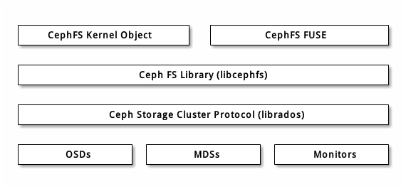

# Ceph客户端
Ceph客户端包括数种服务接口，有：
* 块设备：Ceph块设备（也叫RBD）服务提供了大小可调、精炼、支持快照和克隆的块设备。为提供高性能，Ceph把块设备条带化到整个集群。Ceph同时支持内核对象（KO）和QEMU管理程序直接使用**librbd** ——避免了内核对象在虚拟系统上的开销。
* 对象存储：Ceph对象存储（也叫RGW）服务提供了**RESTful**风格的API，它与Amazon S3和OpenStack Swift兼容。
* 文件系统：Ceph文件系统（CephFS）服务提供了兼容POSIX的文件系统，可以**直接mount**或挂载为**用户空间文件系统（FUSE）**。

Ceph能额外运行多个OSD、MDS、和监视器来保证伸缩性和高可靠性，下图描述了高级架构。

## Ceph对象存储
Ceph对象存储守护进程，radosgw，是一个FastCGI服务，它提供了**RESTful**风格的HTTP API用于存储对象和元数据。它位于Ceph存储集群之上，有自己的数据格式，并维护着自己的用户数据库、认证、和访问控制。RADOS网关使用统一的命名空间，也就是说，你可以用 OpenStack Swift兼容的API或者Amazon S3兼容的API；例如，你可以用一个程序通过S3兼容API写入数据、然后用另一个程序通过Swift 兼容API读出。

Ceph对象存储用对象这个术语来描述它存储的数据。S3和Swift对象不同于Ceph写入存储集群的对象，Ceph对象存储系统内的对象可以映射到Ceph存储集群内的对象；S3和Swift对象却不一定1:1地映射到存储集群内的对象，它有可能映射到了多个Ceph对象。

## Ceph块设备
Ceph块设备把**一个设备映像条带化到集群内的多个对象**，其中各对象映射到一个归置组并分布出去，这些归置组会分散到整个集群的 ceph-osd守护进程上。

精简的、可快照的Ceph块设备对虚拟化和云计算很有吸引力。在虚拟机场景中，人们一般会用Qemu/KVM中的rbd网络存储驱动部署Ceph块设备，其中宿主机用librbd向客户机提供块设备服务；很多云计算堆栈用libvirt和管理程序集成。你可以用精简的Ceph块设备搭配Qemu和libvirt来支持OpenStack和CloudStack，一起构成完整的方案。

现在librbd还不支持其它管理程序，你也可以用Ceph块设备内核对象向客户端提供块设备。其它虚拟化技术，像Xen能访问Ceph块设备内核对象，用命令行工具rbd实现。

## Ceph 文件系统
Ceph文件系统（Ceph FS）提供与POSIX兼容的文件系统服务，坐于基于对象的Ceph存储集群之上，其内的文件被映射到Ceph存储集群内的对象。客户端可以把此文件系统挂载在内核对象或用户空间文件系统（FUSE）上。

Ceph文件系统服务包含随Ceph存储集群部署的元数据服务器（MDS）。MDS的作用是把所有文件系统元数据（目录、文件所有者、访问模式等等）永久存储在相当可靠的元数据服务器中内存中。 MDS（名为ceph-mds的守护进程）存在的原因是，简单的文件系统操作像列出目录（ls）、或进入目录（cd）这些操作会不必要的扰动**OSD**。所以把元数据从数据里分出来意味着Ceph文件系统能提供高性能服务，又能减轻存储集群负载。

Ceph FS从数据中分离出了元数据、并存储于MDS，文件数据存储于存储集群中的一或多个对象。Ceph力争兼容POSIX。ceph-mds可以只运行一个，也可以分布于多台物理机器，以获得高可用性或伸缩性。
* 高可用性： 多余的ceph-mds例程可处于standby（待命）状态，随时准备替下之前处于active（活跃）状态的故障ceph-mds。这可以轻易做到，因为所有数据、包括日志都存储在RADOS上，这个转换过程由ceph-mon自动触发。
* 伸缩性： 多个ceph-mds例程可以同时处于active状态，它们会把目录树拆分为子树（和单个热点目录的分片），在所有活跃服务器间高效地均衡负载。